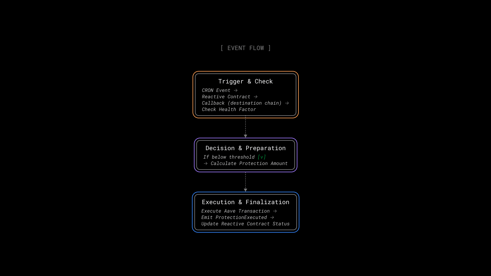
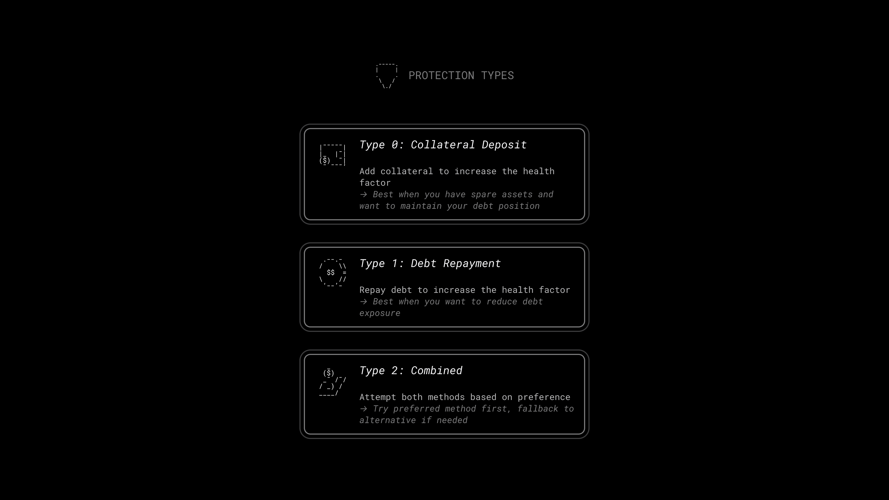

# Aave Liquidation Protection Demo

## Overview

The **Aave Liquidation Protection Demo** keeps your Aave position from getting liquidated. A Reactive contract watches your health factor on a CRON schedule and reacts the moment it dips below your threshold, topping up collateral, repaying debt, or both — before liquidators can act.





## Contracts

**Callback Contract**: [AaveProtectionDemoCallback](https://github.com/Reactive-Network/reactive-smart-contract-demos/blob/main/src/demos/aave-liquidation-protection/AaveProtectionDemoCallback.sol) runs the protection logic on the destination chain. When triggered via CRON, it queries your health factor from Aave, calculates the exact amount needed to reach your target, and executes the right action (collateral deposit, debt repayment, or both) through Aave's lending pool. It then emits events the Reactive contract picks up to stay in sync. Each user deploys their own callback contract, keeping full control over their funds.

**Reactive Contract**: [AaveProtectionDemoReactive](https://github.com/Reactive-Network/reactive-smart-contract-demos/blob/main/src/demos/aave-liquidation-protection/AaveProtectionDemoReactive.sol) listens for CRON events on Reactive Network and lifecycle events from the callback contract on the destinatinon chain. Each time the CRON fires, it calls the callback contract to check and protect all active configurations. It tracks protection status through events emitted by the callback contract: `ProtectionConfigured`, `ProtectionExecuted`, `ProtectionCancelled`, `ProtectionPaused`, `ProtectionResumed`, and `ProtectionCycleCompleted`.

**Rescuable Base Contract**: [RescuableBase](https://github.com/Reactive-Network/reactive-smart-contract-demos/blob/main/src/demos/aave-liquidation-protection/RescuableBase.sol) lets the owner recover stuck ETH or ERC20 tokens from the callback contract, with safety checks and event emissions for transparency.

## Deployment & Testing

### Environment Variables

Before deploying, set the following environment variables:

* `DESTINATION_RPC` — RPC URL for the destination chain, (see [Chainlist](https://chainlist.org)).
* `DESTINATION_PRIVATE_KEY` — Private key for signing transactions on the destination chain.
* `REACTIVE_RPC` — RPC URL for the Reactive Network (see [Reactive Docs](https://dev.reactive.network/reactive-mainnet)).
* `REACTIVE_PRIVATE_KEY` — Private key for signing transactions on the Reactive Network.
* `DESTINATION_CALLBACK_PROXY_ADDR` — The service address on the destination chain (see [Reactive Docs](https://dev.reactive.network/origins-and-destinations#callback-proxy-address)).
* `OWNER_WALLET` — EOA wallet address that will manage the protection system.
* `AAVE_LENDING_POOL` — Aave V3 Lending Pool address (`0x6Ae43d3271ff6888e7Fc43Fd7321a503ff738951` on Ethereum Sepolia)
* `AAVE_PROTOCOL_DATA_PROVIDER` — Aave V3 Protocol Data Provider (`0x3e9708d80f7B3e43118013075F7e95CE3AB31F31` on Ethereum Sepolia)
* `AAVE_ADDRESSES_PROVIDER` — Aave V3 Pool Addresses Provider (`0x012bAC54348C0E635dCAc9D5FB99f06F24136C9A` on Ethereum Sepolia)

> ℹ️ **Reactive Faucet on Sepolia**
>
> To receive testnet REACT, send SepETH to the Reactive faucet contract on Ethereum Sepolia: `0x9b9BB25f1A81078C544C829c5EB7822d747Cf434`. The factor is 1/100, meaning you get 100 REACT for every 1 SepETH sent.
>
> **Important**: Do not send more than 5 SepETH per request, as doing so will cause you to lose the excess amount without receiving any additional REACT. The maximum that should be sent in a single transaction is 5 SepETH, which will yield 500 REACT.

> ⚠️ **Broadcast Error**
> 
> If you see the following message: `error: unexpected argument '--broadcast' found`, it means your Foundry version (or local setup) does not support the `--broadcast` flag for `forge create`. Simply remove `--broadcast` from your command and re-run it.

### Step 1 — Aave Test Tokens

Grab testnet tokens from the [Aave V3 Testnet Faucet](https://staging.aave.com/faucet/). You'll need these to create an Aave position.

**Supported Assets on Aave V3 Ethereum Sepolia:**

| Symbol   | Address                                      |
|----------|----------------------------------------------|
| **DAI**  | `0xFF34B3d4Aee8ddCd6F9AfffB6Fe49bD371b8a357` |
| **LINK** | `0xf8Fb3713D459D7C1018BD0A49D19b4C44290EBE5` |
| **USDC** | `0x94a9D9AC8a22534E3FaCa9F4e7F2E2cf85d5E4C8` |
| **WBTC** | `0x29f2D40B0605204364af54EC677bD022da425d03` |
| **WETH** | `0xC558DBdD856501FCd9aaF1E62eaE57A9F0629a3C` |
| **USDT** | `0xaA8E23Fb1079EA71e0a56f48a2aA51851D8433D0` |
| **AAVE** | `0x88541670E55cC00bEefd87EB59EDd1b7C511AC9A` |
| **EURS** | `0x6d906e526a4e2Ca02097BA9d0caA3c382f52278E` |
| **GHO**  | `0xc4bF5CbDaBE595361438F8c6a187bDC330539c60` |

Save the tokens as `COLLATERAL_ASSET` and `DEBT_ASSET` like so:

```bash
export COLLATERAL_ASSET=0x94a9D9AC8a22534E3FaCa9F4e7F2E2cf85d5E4C8  # USDC on Sepolia
export DEBT_ASSET=0xFF34B3d4Aee8ddCd6F9AFFFB6Fe49bD371b8a357      # DAI on Sepolia
```

### Step 2 — Callback Contract

Deploy the callback contract on the destination chain. Pass the owner wallet, the relevant callback proxy address, and the Aave V3 protocol addresses. Save the `Deployed to` address as `CALLBACK_ADDR`.

```bash
forge create --broadcast --rpc-url $DESTINATION_RPC --private-key $DESTINATION_PRIVATE_KEY src/demos/aave-liquidation-protection/AaveProtectionDemoCallback.sol:AaveProtectionDemoCallback --value 0.02ether --constructor-args $OWNER_WALLET $DESTINATION_CALLBACK_PROXY_ADDR $AAVE_LENDING_POOL $AAVE_PROTOCOL_DATA_PROVIDER $AAVE_ADDRESSES_PROVIDER
```

### Step 3a — Supply Collateral

You need an active Aave position before setting up protection. First, approve the Aave lending pool to spend your collateral (100 tokens):

```bash
cast send $COLLATERAL_ASSET 'approve(address,uint256)' --rpc-url $DESTINATION_RPC --private-key $DESTINATION_PRIVATE_KEY $AAVE_LENDING_POOL 100000000000000000000
```

Then supply it with 50 tokens and `0` for no referral (a required no-op):

```bash
cast send $AAVE_LENDING_POOL 'supply(address,uint256,address,uint16)' --rpc-url $DESTINATION_RPC --private-key $DESTINATION_PRIVATE_KEY $COLLATERAL_ASSET 50000000000000000000 $OWNER_WALLET 0
```

### Step 3b — Borrow Assets

Borrow against your collateral specifying:

- asset to borrow
- 10 tokens
- `2` as a variable interest rate
- `0` no referral
- borrow on behalf of this address

```bash
cast send $AAVE_LENDING_POOL 'borrow(address,uint256,uint256,uint16,address)' --rpc-url $DESTINATION_RPC --private-key $DESTINATION_PRIVATE_KEY $DEBT_ASSET 10000000000000000000 2 0 $OWNER_WALLET
```

### Step 4 — Reactive Contract

Deploy the Reactive contract with the following constructor arguments:

- `OWNER_WALLET`: Wallet address that owns the protection system.
- `CALLBACK_ADDR`: Address from Step 2.
- `CRON_TOPIC`: CRON topic ID for periodic monitoring (e.g., `0x04463f7c1651e6b9774d7f85c85bb94654e3c46ca79b0c16fb16d4183307b687` for 1-minute intervals).

```bash
forge create --broadcast --rpc-url $REACTIVE_RPC --private-key $REACTIVE_PRIVATE_KEY src/demos/aave-liquidation-protection/AaveProtectionDemoReactive.sol:AaveProtectionDemoReactive --value 0.5ether --constructor-args $OWNER_WALLET $CALLBACK_ADDR $CRON_TOPIC
```

> 📝 **Note**  
> The CRON topic controls how often the Reactive contract checks your position. Check the [Reactive Docs](https://dev.reactive.network/reactive-library#cron-functionality) for available CRON topics and intervals.

### Step 5 — Create Protection Configuration

Set up a protection config on the callback contract with these parameters:

- `PROTECTION_TYPE`: `0` = Collateral Deposit, `1` = Debt Repayment, `2` = Both.
- `HEALTH_FACTOR_THRESHOLD`: Health factor that triggers protection (e.g., 1500000000000000000 for 1.5).
- `TARGET_HEALTH_FACTOR`: Health factor to restore after protection (e.g., 2000000000000000000 for 2.0).
- `PREFER_DEBT_REPAYMENT`: When using type 2, whether to try debt repayment first (`true`/`false`).

```bash
cast send $CALLBACK_ADDR 'createProtectionConfig(uint8,uint256,uint256,address,address,bool)' --rpc-url $DESTINATION_RPC --private-key $DESTINATION_PRIVATE_KEY $PROTECTION_TYPE $HEALTH_FACTOR_THRESHOLD $TARGET_HEALTH_FACTOR $COLLATERAL_ASSET $DEBT_ASSET $PREFER_DEBT_REPAYMENT
```

Example with threshold = `1.5`, target = `2.0`, type = `Both`, prefer debt repayment:

```bash
cast send $CALLBACK_ADDR 'createProtectionConfig(uint8,uint256,uint256,address,address,bool)' --rpc-url $DESTINATION_RPC --private-key $DESTINATION_PRIVATE_KEY 2 1500000000000000000 2000000000000000000 $COLLATERAL_ASSET $DEBT_ASSET true
```

### Step 6a — Approve Collateral Asset

Allow the callback contract to spend your collateral when protection triggers (1000 tokens):

```bash
cast send $COLLATERAL_ASSET 'approve(address,uint256)' --rpc-url $DESTINATION_RPC --private-key $DESTINATION_PRIVATE_KEY $CALLBACK_ADDR 1000000000000000000000
```

### Step 6b — Approve Debt Asset

Allow the callback contract to spend your debt tokens when protection triggers (1000 tokens):

```bash
cast send $DEBT_ASSET 'approve(address,uint256)' --rpc-url $DESTINATION_RPC --private-key $DESTINATION_PRIVATE_KEY $CALLBACK_ADDR 1000000000000000000000
```

> 📝 **Note**  
> Keep enough balance of both assets in your wallet as the callback contract pulls funds on demand.

### Step 7 — Monitor Protection

The Reactive contract now watches your Aave position on the CRON schedule. When your health factor drops below the threshold, it triggers the callback contract, which calculates the required amount and executes the protection, and then emits events the Reactive contract picks up.

If tesing on Ethereum Sepolia, track protection execution on [Etherscan](https://sepolia.etherscan.io/) by watching the callback contract's events.

#### Check Current Health Factor

```bash
cast call $CALLBACK_ADDR 'getCurrentHealthFactor()' --rpc-url $DESTINATION_RPC
```

#### View Active Configurations

```bash
cast call $CALLBACK_ADDR 'getActiveConfigs()' --rpc-url $DESTINATION_RPC
```

#### View Protection Configuration

```bash
cast call $CALLBACK_ADDR 'protectionConfigs(uint256)' $CONFIG_ID --rpc-url $DESTINATION_RPC
```

### Step 8 — Test Protection Trigger (Optional)

To simulate a health factor drop, borrow more against your collateral specifying:

- asset to borrow
- 5 tokens
- `2` as a variable interest rate
- `0` for no referral code
- borrow on behalf of this address

```bash
cast send $AAVE_LENDING_POOL 'borrow(address,uint256,uint256,uint16,address)' --rpc-url $DESTINATION_RPC --private-key $DESTINATION_PRIVATE_KEY $DEBT_ASSET 5000000000000000000 2 0 $OWNER_WALLET
```

Monitor your health factor. Once it drops below your threshold, protection triggers automatically.

## Management Functions

### Pause Protection

```bash
cast send $CALLBACK_ADDR 'pauseProtectionConfig(uint256)' $CONFIG_ID --rpc-url $DESTINATION_RPC --private-key $DESTINATION_PRIVATE_KEY
```

### Resume Protection

```bash
cast send $CALLBACK_ADDR 'resumeProtectionConfig(uint256)' $CONFIG_ID --rpc-url $DESTINATION_RPC --private-key $DESTINATION_PRIVATE_KEY
```

### Cancel Protection

**Permanent — can't be undone.**

```bash
cast send $CALLBACK_ADDR 'cancelProtectionConfig(uint256)' $CONFIG_ID --rpc-url $DESTINATION_RPC --private-key $DESTINATION_PRIVATE_KEY
```

### Rescue Funds

Recover stuck `ETH` or `ERC-20` tokens from the callback contract:

```bash
cast send $CALLBACK_ADDR 'rescueAllETH()' --rpc-url $DESTINATION_RPC --private-key $DESTINATION_PRIVATE_KEY
```

```bash
cast send $CALLBACK_ADDR 'rescueAllERC20(address)' $TOKEN_ADDRESS --rpc-url $DESTINATION_RPC --private-key $DESTINATION_PRIVATE_KEY
```
