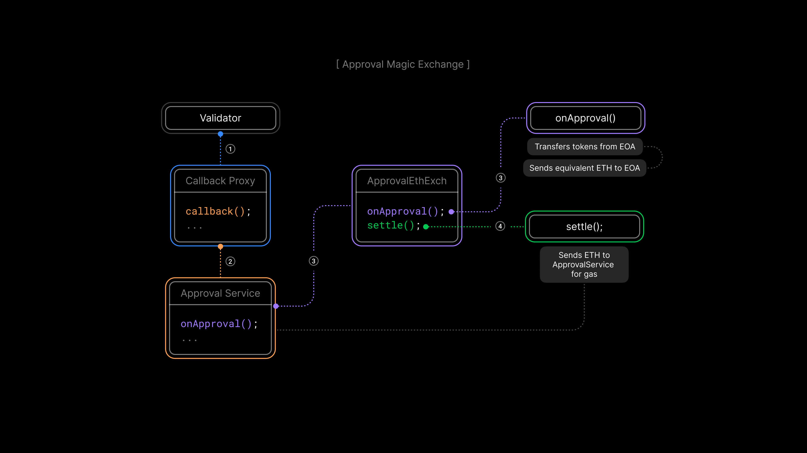
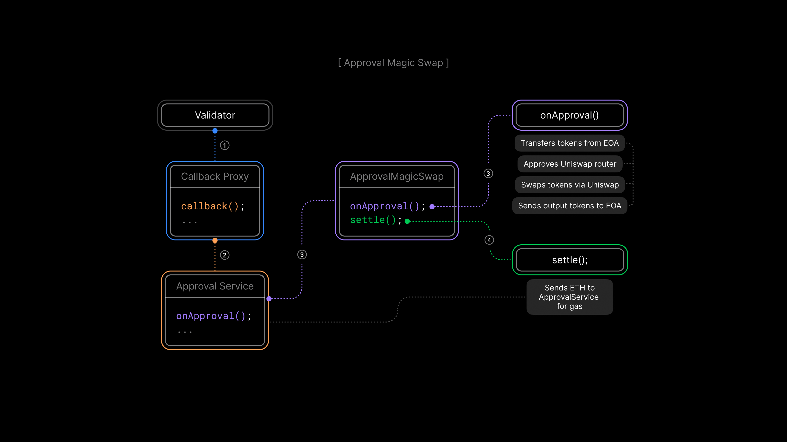

# Approval Magic Demo

## Overview

The **Approval Magic Demo** extends reactive and subscription-based concepts to implement an approval-based token exchange across multiple chains. The provided smart contracts facilitate token transfers and swaps by monitoring token approvals and reacting accordingly. The demo shows how an approval service integrated with the Reactive Network manages and executes cross-chain token exchanges, with each smart contract serving a distinct role in the overall workflow.

## Magic Exchange Flow



1. Validator calls `callback()` on `CallbackProxy`.
2. `CallbackProxy` calls `onApproval()` on `ApprovalService`.
3. `ApprovalService` calls `onApproval()` on `ApprovalEthExch`, which:
    - Transfers tokens from the EOA signing the transaction.
    - Sends ETH to the EOA signing the transaction, equivalent to the token amount.
4. `ApprovalService` then calls `settle()` on `ApprovalEthExch`, which:
    - Sends ETH to `ApprovalService` for gas.

## Magic Swap Flow



1. Validator calls `callback()` on `CallbackProxy`.
2. `CallbackProxy` calls `onApproval()` on `ApprovalService`.
3. `ApprovalService` calls `onApproval()` on `ApprovalMagicSwap`, which:
   - Transfers approved tokens from the EOA signing the transaction.
   - Approves Uniswap router.
   - Swaps the tokens via Uniswap.
   - Sends the output tokens back to the EOA signing the transaction.
4. `ApprovalService` then calls `settle()` on `ApprovalMagicSwap`, which:
   - Sends ETH to `ApprovalService` for gas.

## Contracts

**Subscription-Based Approval Service**: The [ApprovalService](https://github.com/Reactive-Network/reactive-smart-contract-demos/blob/main/src/demos/approval-magic/ApprovalService.sol) contract is responsible for subscription-based approvals. Users (or contracts) can subscribe by paying a fee, enabling them to receive and process approval callbacks that originate from token approvals. This service tracks subscribers, covers the gas cost of triggered callbacks, and emits `Subscribe`/`Unsubscribe` events. If the subscription conditions aren’t met or a contract fails to pay for its gas usage, the subscriber is automatically unsubscribed.

**Reactive Contract**: The [ApprovalListener](https://github.com/Reactive-Network/reactive-smart-contract-demos/blob/main/src/demos/approval-magic/ApprovalListener.sol) contract elaborates on how the Reactive Network can integrate with the `ApprovalService`. It listens for specific log events — such as `Subscribe`, `Unsubscribe`, and ERC-20 approval signatures — and reacts accordingly. When these events occur, `ApprovalListener` triggers callbacks to manage subscriptions or handle token approvals.

**Token Initialization and Distribution**: The [ApprovalDemoToken](https://github.com/Reactive-Network/reactive-smart-contract-demos/blob/main/src/demos/approval-magic/ApprovalDemoToken.sol) is an ERC-20 token used for testing. At deployment, it mints 100 tokens for the deployer. Additionally, anyone can call `request()` once to receive 1 token (costing 1 Ether).

**Token Exchange**: The [ApprovalEthExch](https://github.com/Reactive-Network/reactive-smart-contract-demos/blob/main/src/demos/approval-magic/ApprovalEthExch.sol) contract shows how a subscription-based approval flow can facilitate token-for-ETH exchanges. It relies on `ApprovalService` to handle approval callbacks, ensuring tokens can be transferred without requiring extra user interaction. Owners can manage subscriptions, withdraw funds, and perform this exchange as a building block for more complex trading or DeFi protocols.

**Automated Token Swaps**: The [ApprovalMagicSwap](https://github.com/Reactive-Network/reactive-smart-contract-demos/blob/main/src/demos/approval-magic/ApprovalMagicSwap.sol) contract extends the subscription-based approach by incorporating Uniswap V2 token swaps. When a token approval triggers a callback, this contract automatically swaps the approved tokens for another ERC-20 token via Uniswap — again, without requiring the user to take any extra steps.

## Further Considerations

Deploying these smart contracts in a live environment involves addressing key considerations:

- **Security:** Ensuring security measures for token approvals and transfers to prevent unauthorized access.
- **Scalability:** Managing a high volume of subscribers and transactions to maintain performance.
- **Gas Optimization:** Reducing gas costs associated with approval handling to improve economic viability.
- **Interoperability:** Expanding support to a wider range of tokens and networks to improve versatility.

## Deployment & Testing

### Environment Variables

Before proceeding further, configure these environment variables:

* `DESTINATION_RPC` — RPC URL for the destination chain, (see [Chainlist](https://chainlist.org)).
* `DESTINATION_PRIVATE_KEY` — Private key for signing transactions on the destination chain.
* `REACTIVE_RPC` — RPC URL for the Reactive Network (see [Reactive Docs](https://dev.reactive.network/reactive-mainnet)).
* `REACTIVE_PRIVATE_KEY` — Private key for signing transactions on the Reactive Network.
* `CLIENT_WALLET` — Deployer's EOA wallet address
* `DESTINATION_CALLBACK_PROXY_ADDR` — The service address on the destination chain (see [Reactive Docs](https://dev.reactive.network/origins-and-destinations#callback-proxy-address)).

> ℹ️ **Reactive Faucet on Sepolia**
> 
> To receive testnet REACT, send SepETH to the Reactive faucet contract on Ethereum Sepolia: `0x9b9BB25f1A81078C544C829c5EB7822d747Cf434`. The factor is 1/5, meaning you get 5 REACT for every 1 SepETH sent.
> 
> **Important**: Do not send more than 10 SepETH per request, as doing so will cause you to lose the excess amount without receiving any additional REACT. The maximum that should be sent in a single transaction is 10 SepETH, which will yield 50 REACT.

> ⚠️ **Broadcast Error**
> 
> If you see the following message: `error: unexpected argument '--broadcast' found`, it means your Foundry version (or local setup) does not support the `--broadcast` flag for `forge create`. Simply remove `--broadcast` from your command and re-run it.

> 📝 **Note**
> 
> Use the same private key for deploying `ApprovalService` and `ApprovalListener`. `ApprovalDemoToken` and `ApprovalEthExch` may use different keys if needed.

## Magic Exchange

### Step 1 — Approval Service

Use the pre-deployed `ApprovalService` contract or deploy your own.

```bash
export APPROVAL_SRV_ADDR=0xfc2236a0d3421473676c4c422046fbc4f1afdffe
```

To deploy `ApprovalService`, run the following command with the specified constructor arguments:

- Subscription Fee: `123wei`
- Gas Price Coefficient: `2`
- Extra Gas for Reactive Service: `35000`

```bash
forge create --broadcast --rpc-url $DESTINATION_RPC --private-key $DESTINATION_PRIVATE_KEY src/demos/approval-magic/ApprovalService.sol:ApprovalService --value 0.03ether --constructor-args $DESTINATION_CALLBACK_PROXY_ADDR 123wei 2 35000
```

The `Deployed to` address from the response should be assigned to `APPROVAL_SRV_ADDR`.

### Step 2 — Approval Listener

Use the pre-deployed `ApprovalListener` contract or deploy your own.

```bash
export APPROVAL_RCT_ADDR=0xc3e185561D2a8b04F0Fcd104A562f460D6cC503c
```

Deploy the `ApprovalListener` contract using the same private key from Step 1. This ensures the `ApprovalService` contract can authenticate the RVM ID for callbacks.

```bash
forge create --broadcast --rpc-url $REACTIVE_RPC --private-key $DESTINATION_PRIVATE_KEY src/demos/approval-magic/ApprovalListener.sol:ApprovalListener --value 0.1ether --constructor-args $DESTINATION_CHAIN_ID $APPROVAL_SRV_ADDR
```

The `Deployed to` address should be assigned to `APPROVAL_RCT_ADDR`.

### Step 3 — Token Contract Deployment

Deploy the `ApprovalDemoToken` contract with the specified name and symbol (e.g., `"FTW"`):

```bash
forge create --broadcast --rpc-url $DESTINATION_RPC --private-key $DESTINATION_PRIVATE_KEY src/demos/approval-magic/ApprovalDemoToken.sol:ApprovalDemoToken --constructor-args "FTW" "FTW"
```

The `Deployed to` address should be assigned to `TOKEN_ADDR`.

### Step 4 — Exchange Contract Deployment

Deploy the `ApprovalEthExch` contract:

```bash
forge create --broadcast --rpc-url $DESTINATION_RPC --private-key $DESTINATION_PRIVATE_KEY src/demos/approval-magic/ApprovalEthExch.sol:ApprovalEthExch --value 0.01ether --constructor-args $APPROVAL_SRV_ADDR $TOKEN_ADDR
```

The `Deployed to` address should be assigned to `EXCH_ADDR`.

### Step 5 — Subscribe and Approve

Subscribe the exchange contract to `ApprovalService`:

```bash
cast send --rpc-url $DESTINATION_RPC --private-key $DESTINATION_PRIVATE_KEY $EXCH_ADDR "subscribe()" 
```

> 📝 **Note**
> The subscription process takes approximately 30 seconds, accounting for both destination and Reactive's block intervals, before the service starts processing approvals.

Approve the transfer of `1000` tokens (in Wei) to the exchange contract:

```bash
cast send --rpc-url $DESTINATION_RPC --private-key $DESTINATION_PRIVATE_KEY $TOKEN_ADDR "approve(address,uint256)" $EXCH_ADDR 1000 
```

## Magic Swap

### Step 1 — Token Deployment

Use the pre-deployed tokens or deploy your own.

```bash
export TOKEN1_ADDR=0xBa1aD75feE4d0bC41A946466443790da4b14825c
export TOKEN2_ADDR=0x764396E26e0D9d7A544e8b4E45efA1048364F294
```

You can request each token once:

```bash
cast send --rpc-url $DESTINATION_RPC --private-key $DESTINATION_PRIVATE_KEY 0xBa1aD75feE4d0bC41A946466443790da4b14825c "request()" 
```

```bash
cast send --rpc-url $DESTINATION_RPC --private-key $DESTINATION_PRIVATE_KEY 0x764396E26e0D9d7A544e8b4E45efA1048364F294 "request()"
```

Or deploy two tokens, each with constructor arguments `"TOKEN_NAME"` and `"TOKEN_SYMBOL"`:

```bash
forge create --broadcast --rpc-url $DESTINATION_RPC --private-key $DESTINATION_PRIVATE_KEY src/demos/approval-magic/ApprovalDemoToken.sol:ApprovalDemoToken --constructor-args "TK1" "TK1"
```

The `Deployed to` address should be assigned to `TOKEN1_ADDR`.

```bash
forge create --broadcast --rpc-url $DESTINATION_RPC --private-key $DESTINATION_PRIVATE_KEY src/demos/approval-magic/ApprovalDemoToken.sol:ApprovalDemoToken --constructor-args "TK2" "TK2"
```

The `Deployed to` address should be assigned to `TOKEN2_ADDR`.

### Step 2 — Create Liquidity Pool

If you use pre-deployed tokens from the previous step, export the address of their Uniswap pair:

```bash
export UNISWAP_PAIR_ADDR=0x0498833E5632BC525d57D84F4d0f2f063adf678D
```

To create a new pair, run the following command with the Uniswap V2 Factory contract `0x7E0987E5b3a30e3f2828572Bb659A548460a3003` and the token addresses deployed in the previous step.

```bash
cast send --rpc-url $DESTINATION_RPC --private-key $DESTINATION_PRIVATE_KEY 0x7E0987E5b3a30e3f2828572Bb659A548460a3003 'createPair(address,address)' $TOKEN1_ADDR $TOKEN2_ADDR
```

Assign the Uniswap pair address from transaction logs as shown on [Sepolia scan](https://sepolia.etherscan.io/tx/0x4a373bc6ebe815105abf44e6b26e9cdcd561fb9e796196849ae874c7083692a4/advanced#eventlog) to `UNISWAP_PAIR_ADDR`.

### Step 3 — Add Funds and Mint

Transfer liquidity into the created pool:

```bash
cast send --rpc-url $DESTINATION_RPC --private-key $DESTINATION_PRIVATE_KEY $TOKEN1_ADDR 'transfer(address,uint256)' $UNISWAP_PAIR_ADDR 0.5ether
```
```bash
cast send --rpc-url $DESTINATION_RPC --private-key $DESTINATION_PRIVATE_KEY $TOKEN2_ADDR 'transfer(address,uint256)' $UNISWAP_PAIR_ADDR 0.5ether
```

Mint the liquidity pool tokens to your wallet:

```bash
cast send --rpc-url $DESTINATION_RPC --private-key $DESTINATION_PRIVATE_KEY $UNISWAP_PAIR_ADDR 'mint(address)' $CLIENT_WALLET
```

### Step 4 — Swap Contract Deployment

Use the pre-deployed swap contract or deploy your own.

```bash
export SWAP_ADDR=0x08295A6650b7388B6941dD7Fe5c03E9EC895DBA9
```

To deploy the `ApprovalMagicSwap` contract:

```bash
forge create --broadcast --rpc-url $DESTINATION_RPC --private-key $DESTINATION_PRIVATE_KEY src/demos/approval-magic/ApprovalMagicSwap.sol:ApprovalMagicSwap --value 0.01ether --constructor-args $APPROVAL_SRV_ADDR $TOKEN1_ADDR $TOKEN2_ADDR
```

The `Deployed to` address should be assigned to `SWAP_ADDR`.

### Step 5 — Subscribe and Approve

Subscribe the swap contract to `ApprovalService`:

```bash
cast send --rpc-url $DESTINATION_RPC --private-key $DESTINATION_PRIVATE_KEY $SWAP_ADDR "subscribe()"
```

See the magic in action by approving one of the tokens (e.g., `TOKEN1_ADDR`) for the swap contract:

```bash
cast send --rpc-url $DESTINATION_RPC --private-key $DESTINATION_PRIVATE_KEY $TOKEN1_ADDR "approve(address,uint256)" $SWAP_ADDR 0.1ether 
```