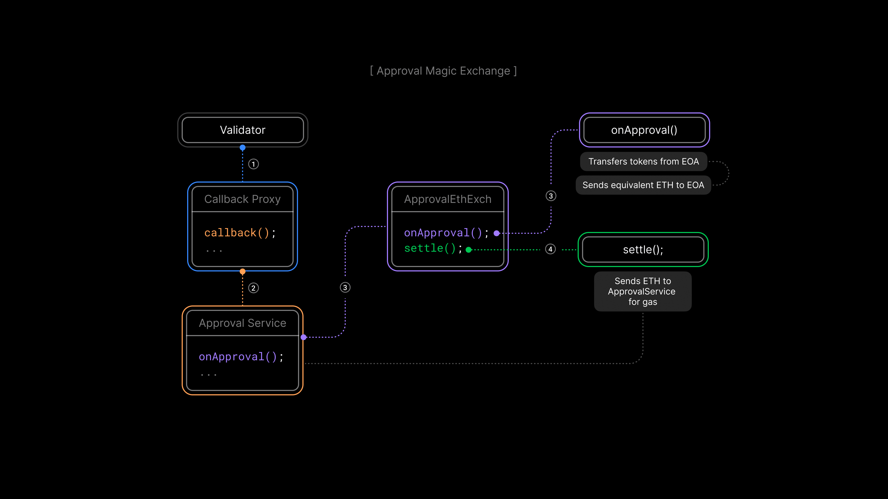
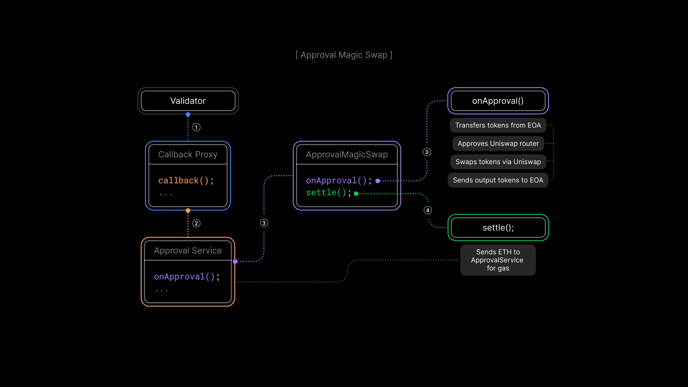

# Approval Magic Demo

## Overview

The **Approval Magic Demo** shows how a token approval can automatically trigger a cross-chain exchange or swap, with no additional user interaction. When a user calls `approve()` on an ERC-20 token, Reactive Network detects the `Approval` event and initiates a callback that executes the trade on the user's behalf.

The workflow is built around an `ApprovalService` contract that acts as a subscription registry. Contracts that want to react to token approvals subscribe to the service by paying a fee. `ApprovalListener` (Reactive contract) monitors three event types on the destination chain: new subscriptions, unsubscriptions, and ERC-20 approvals. When an approval targets a subscribed contract, the listener triggers a callback that transfers the approved tokens and completes the trade: either a direct token-for-ETH exchange or a token-for-token swap via Uniswap V2.

The demo includes both flows: a **Magic Exchange** (tokens → ETH) and a **Magic Swap** (tokens → tokens via Uniswap).

## Magic Exchange Flow



1. Validator calls `callback()` on `CallbackProxy`.
2. `CallbackProxy` calls `onApproval()` on `ApprovalService`.
3. `ApprovalService` calls `onApproval()` on `ApprovalEthExch`, which:
    - Transfers tokens from the EOA signing the transaction.
    - Sends ETH to the EOA signing the transaction, equivalent to the token amount.
4. `ApprovalService` then calls `settle()` on `ApprovalEthExch`, which:
    - Sends ETH to `ApprovalService` for gas.

## Magic Swap Flow



1. Validator calls `callback()` on `CallbackProxy`.
2. `CallbackProxy` calls `onApproval()` on `ApprovalService`.
3. `ApprovalService` calls `onApproval()` on `ApprovalMagicSwap`, which:
   - Transfers approved tokens from the EOA signing the transaction.
   - Approves Uniswap router.
   - Swaps the tokens via Uniswap.
   - Sends the output tokens back to the EOA signing the transaction.
4. `ApprovalService` then calls `settle()` on `ApprovalMagicSwap`, which:
   - Sends ETH to `ApprovalService` for gas.

## Contracts

**Subscription-Based Approval Service**: [ApprovalService](https://github.com/Reactive-Network/reactive-smart-contract-demos/blob/main/src/demos/approval-magic/ApprovalService.sol) is the subscription registry on the destination chain. Contracts subscribe by paying a fee, which enables them to receive approval callbacks. The service tracks active subscribers, covers the gas cost of triggered callbacks, and automatically unsubscribes contracts that fail to settle their gas usage. It emits `Subscribe` and `Unsubscribe` events that the reactive listener monitors.

**Reactive Contract**: [ApprovalListener](https://github.com/Reactive-Network/reactive-smart-contract-demos/blob/main/src/demos/approval-magic/ApprovalListener.sol) is the Reactive contract running on Reactive Network. It subscribes to three event types on the destination chain: `Subscribe` and `Unsubscribe` events from the `ApprovalService`, and ERC-20 `Approval` events from any token contract. When an approval targets a subscribed contract, the listener emits a `Callback` event that triggers the approval handler on the destination chain.

**Token Initialization and Distribution**: [ApprovalDemoToken](https://github.com/Reactive-Network/reactive-smart-contract-demos/blob/main/src/demos/approval-magic/ApprovalDemoToken.sol) is an ERC-20 token for testing. It mints 100 tokens to the deployer on creation, and anyone can call `request()` once to receive 1 token for 1 ETH.

**Token Exchange**: [ApprovalEthExch](https://github.com/Reactive-Network/reactive-smart-contract-demos/blob/main/src/demos/approval-magic/ApprovalEthExch.sol) handles the token-for-ETH exchange flow. When triggered by an approval callback, it transfers the approved tokens from the user and sends back an equivalent amount of ETH. After execution, it settles gas costs with the `ApprovalService`.

**Automated Token Swaps**: [ApprovalMagicSwap](https://github.com/Reactive-Network/reactive-smart-contract-demos/blob/main/src/demos/approval-magic/ApprovalMagicSwap.sol) handles the token-for-token swap flow. When triggered, it transfers the approved tokens from the user, approves the Uniswap V2 Router, executes the swap, and sends the output tokens back to the user. Like the exchange contract, it settles gas costs with the `ApprovalService` after execution.

## Deployment & Testing

### Environment Variables

Before deploying, set the following environment variables:

* `DESTINATION_RPC` — RPC URL for the destination chain, (see [Chainlist](https://chainlist.org)).
* `DESTINATION_PRIVATE_KEY` — Private key for signing transactions on the destination chain.
* `REACTIVE_RPC` — RPC URL for Reactive Network (see [Reactive Docs](https://dev.reactive.network/reactive-mainnet)).
* `REACTIVE_PRIVATE_KEY` — Private key for signing transactions on Reactive Network.
* `CLIENT_WALLET` — Deployer's EOA wallet address
* `DESTINATION_CALLBACK_PROXY_ADDR` — The callback proxy address on the destination chain (see [Reactive Docs](https://dev.reactive.network/origins-and-destinations#callback-proxy-address)).

> ℹ️ **Reactive faucet on Ethereum Sepolia**
>
> To receive testnet REACT, send SepETH to the Reactive faucet on Ethereum Sepolia: `0x9b9BB25f1A81078C544C829c5EB7822d747Cf434`. The exchange rate is 100 REACT per 1 SepETH. Do not send more than 5 SepETH in a single transaction as any excess is lost.

> ⚠️ **Broadcast Error**
>
> If you see `error: unexpected argument '--broadcast' found`, your Foundry version does not support the `--broadcast` flag for `forge create`. Remove it from the command and re-run.

> 📝 **Private Key Reuse**
> 
> Use the same private key for deploying `ApprovalService` and `ApprovalListener`. It's required by `ApprovalService` to authenticate the RVM ID for callbacks. Other contracts may use different keys.

## Magic Exchange

This flow exchanges tokens for ETH. A single `approve()` from the user triggers the full exchange.

### Step 1 — Approval Service

Use the pre-deployed `ApprovalService` contract or deploy your own. The constructor takes a subscription fee (`123wei`), a gas price coefficient (`2`), and extra gas for Reactive service (`35000`).

```bash
export APPROVAL_SRV_ADDR=0xfc2236a0d3421473676c4c422046fbc4f1afdffe
```

```bash
forge create --broadcast --rpc-url $DESTINATION_RPC --private-key $DESTINATION_PRIVATE_KEY src/demos/approval-magic/ApprovalService.sol:ApprovalService --value 0.03ether --constructor-args $DESTINATION_CALLBACK_PROXY_ADDR 123wei 2 35000
```

Save the `Deployed to` address as `APPROVAL_SRV_ADDR`.

### Step 2 — Approval Listener

Use the pre-deployed `ApprovalListener` contract or deploy your own with the **same private key** used in Step 1.

```bash
export APPROVAL_RCT_ADDR=0xc3e185561D2a8b04F0Fcd104A562f460D6cC503c
```

```bash
forge create --broadcast --rpc-url $REACTIVE_RPC --private-key $DESTINATION_PRIVATE_KEY src/demos/approval-magic/ApprovalListener.sol:ApprovalListener --value 0.5ether --constructor-args $DESTINATION_CHAIN_ID $APPROVAL_SRV_ADDR
```

Save the `Deployed to` address as `APPROVAL_RCT_ADDR`.

### Step 3 — Test Token

Deploy `ApprovalDemoToken` with a name and symbol (e.g. `"FTW"`).

```bash
forge create --broadcast --rpc-url $DESTINATION_RPC --private-key $DESTINATION_PRIVATE_KEY src/demos/approval-magic/ApprovalDemoToken.sol:ApprovalDemoToken --constructor-args "FTW" "FTW"
```

Save the `Deployed to` address as `TOKEN_ADDR`.

### Step 4 — Exchange Contract

Deploy `ApprovalEthExch`, passing the approval service and token addresses. 

```bash
forge create --broadcast --rpc-url $DESTINATION_RPC --private-key $DESTINATION_PRIVATE_KEY src/demos/approval-magic/ApprovalEthExch.sol:ApprovalEthExch --value 0.01ether --constructor-args $APPROVAL_SRV_ADDR $TOKEN_ADDR
```

Save the `Deployed to` address as `EXCH_ADDR`.

### Step 5 — Subscribe and Trigger Exchange

Subscribe the exchange contract to `ApprovalService`:

```bash
cast send --rpc-url $DESTINATION_RPC --private-key $DESTINATION_PRIVATE_KEY $EXCH_ADDR "subscribe()" 
```

Wait approximately 30 seconds for the subscription to propagate across destination and Reactive block intervals. Then approve the exchange contract to spend your tokens. This single transaction triggers the full exchange:

```bash
cast send --rpc-url $DESTINATION_RPC --private-key $DESTINATION_PRIVATE_KEY $TOKEN_ADDR "approve(address,uint256)" $EXCH_ADDR 1000 
```

## Magic Swap

This flow swaps one token for another via Uniswap V2. As with the exchange flow, a single `approve()` triggers the full swap.

This flow reuses `ApprovalService` and `ApprovalListener` deployed in the Magic Exchange section. If you haven't deployed them yet, complete Steps 1 and 2 above first.

### Step 1 — Test Tokens

Use the pre-deployed tokens or deploy your own:

```bash
export TOKEN1_ADDR=0xBa1aD75feE4d0bC41A946466443790da4b14825c
export TOKEN2_ADDR=0x764396E26e0D9d7A544e8b4E45efA1048364F294
```

You can request each token once:

```bash
cast send --rpc-url $DESTINATION_RPC --private-key $DESTINATION_PRIVATE_KEY 0xBa1aD75feE4d0bC41A946466443790da4b14825c "request()" 
```

```bash
cast send --rpc-url $DESTINATION_RPC --private-key $DESTINATION_PRIVATE_KEY 0x764396E26e0D9d7A544e8b4E45efA1048364F294 "request()"
```

Deploy your own tokens, each with the constructor arguments `"TOKEN_NAME"` and `"TOKEN_SYMBOL"`:

```bash
forge create --broadcast --rpc-url $DESTINATION_RPC --private-key $DESTINATION_PRIVATE_KEY src/demos/approval-magic/ApprovalDemoToken.sol:ApprovalDemoToken --constructor-args "TK1" "TK1"
```

```bash
forge create --broadcast --rpc-url $DESTINATION_RPC --private-key $DESTINATION_PRIVATE_KEY src/demos/approval-magic/ApprovalDemoToken.sol:ApprovalDemoToken --constructor-args "TK2" "TK2"
```

Save the addresses as `TOKEN1_ADDR` and `TOKEN2_ADDR`.

### Step 2 — Set Up the Uniswap V2 Pair

Use the pre-existing pair or create a new one:

```bash
export UNISWAP_PAIR_ADDR=0x0498833E5632BC525d57D84F4d0f2f063adf678D
```

To create a new pair, call `createPair()` on the Uniswap V2 Factory at `0x7E0987E5b3a30e3f2828572Bb659A548460a3003`. Retrieve the pair address from the `PairCreated` event on [Ethereum Sepolia Etherscan](https://sepolia.etherscan.io/tx/0x4a373bc6ebe815105abf44e6b26e9cdcd561fb9e796196849ae874c7083692a4/advanced#eventlog) and save it as `UNISWAP_PAIR_ADDR`.

```bash
cast send --rpc-url $DESTINATION_RPC --private-key $DESTINATION_PRIVATE_KEY 0x7E0987E5b3a30e3f2828572Bb659A548460a3003 'createPair(address,address)' $TOKEN1_ADDR $TOKEN2_ADDR
```

### Step 3 — Add Liquidity

Transfer 0.5 tokens of each type into the pair and mint the LP tokens:

```bash
cast send --rpc-url $DESTINATION_RPC --private-key $DESTINATION_PRIVATE_KEY $TOKEN1_ADDR 'transfer(address,uint256)' $UNISWAP_PAIR_ADDR 0.5ether
```
```bash
cast send --rpc-url $DESTINATION_RPC --private-key $DESTINATION_PRIVATE_KEY $TOKEN2_ADDR 'transfer(address,uint256)' $UNISWAP_PAIR_ADDR 0.5ether
```

```bash
cast send --rpc-url $DESTINATION_RPC --private-key $DESTINATION_PRIVATE_KEY $UNISWAP_PAIR_ADDR 'mint(address)' $CLIENT_WALLET
```

### Step 4 — Swap Contract

Use the pre-deployed swap contract or deploy your own:

```bash
export SWAP_ADDR=0x08295A6650b7388B6941dD7Fe5c03E9EC895DBA9
```

```bash
forge create --broadcast --rpc-url $DESTINATION_RPC --private-key $DESTINATION_PRIVATE_KEY src/demos/approval-magic/ApprovalMagicSwap.sol:ApprovalMagicSwap --value 0.01ether --constructor-args $APPROVAL_SRV_ADDR $TOKEN1_ADDR $TOKEN2_ADDR
```

Save the `Deployed to` address as `SWAP_ADDR`.

### Step 5 — Subscribe and Trigger Swap

Subscribe the swap contract to `ApprovalService`:

```bash
cast send --rpc-url $DESTINATION_RPC --private-key $DESTINATION_PRIVATE_KEY $SWAP_ADDR "subscribe()"
```

Then approve one of the tokens for the swap contract. This transaction triggers the full swap:

```bash
cast send --rpc-url $DESTINATION_RPC --private-key $DESTINATION_PRIVATE_KEY $TOKEN1_ADDR "approve(address,uint256)" $SWAP_ADDR 0.1ether 
```