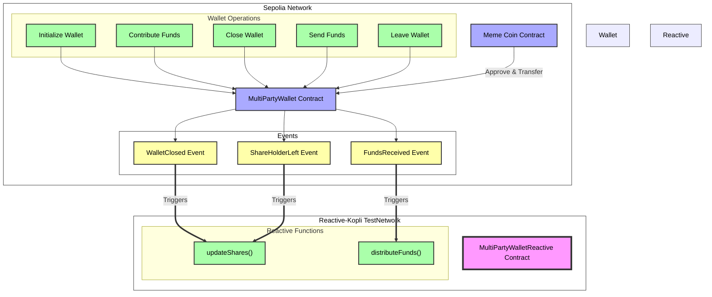

# Automated Funds Distribution

## Overview

This demo implements an automated funds distribution system using smart contracts. It showcases the following key functionalities:

- **Multi-Party Wallet:** A contract that allows multiple users to contribute funds and become shareholders.
- **Automated Distribution:** Utilizes a reactive contract to automatically distribute funds and tokens to shareholders.
- **Dynamic Share Calculation:** Recalculates shares when shareholders leave or new funds are added.

## Contracts

The demo involves three main contracts:

1. **MemeCoin Contract:** An ERC-20 token contract that represents the BananaCoin (BobBanana) used in the system.

2. **MultiPartyWallet Contract:** [Multi-Party Wallet](https://github.com/Reactive-Network/reactive-smart-contract-demos/blob/main/src/demos/automated-funds-distribution/MultiPartyWallet.sol) Manages contributions, shareholding, and fund distribution.

3. **MultiPartyWalletReactive Contract:** [Multi-Party Wallet Reactive](https://github.com/Reactive-Network/reactive-smart-contract-demos/blob/main/src/demos/automated-funds-distribution/MultiPartyWalletReactive.sol) Listens for events: WalletClosed(), FundsReceived(address sender, uint256 amount), ShareholderLeft(address indexed shareholder, uint256 amountWithdrawn, uint256 feesPaid) from the MultiPartyWallet contract and triggers automated actions of updateShares and distributeAllFunds.

## Further Considerations

The demo showcases basic automated distribution functionality but can be improved with:

- **Enhanced Security Measures:** Implementing additional checks and balances for fund management.
- **More Flexible Distribution Rules:** Allowing for customizable distribution schemes.
- **Integration with DeFi Protocols:** Exploring yield-generating opportunities for idle funds.
- **Improved Gas Optimization:** Refining the contract logic to reduce transaction costs.


## Architecture And WorkFlow




## Deployment & Testing

To deploy and test the contracts, follow these steps. Ensure the following environment variables are configured appropriately:

* `SEPOLIA_RPC` — https://rpc2.sepolia.org
* `SEPOLIA_PRIVATE_KEY` — Ethereum Sepolia private key
* `REACTIVE_RPC` — https://kopli-rpc.rkt.ink
* `REACTIVE_PRIVATE_KEY` — Reactive Kopli private key
* `SEPOLIA_CALLBACK_PROXY_ADDR` — 0x33Bbb7D0a2F1029550B0e91f653c4055DC9F4Dd8
* `KOPLI_CALLBACK_PROXY_ADDR` — 0x0000000000000000000000000000000000FFFFFF

also setup the private keys of, as will be used in this example :
* `WALLET_CLOSER`
* `CONTRIBUTOR1_PRIVATE_KEY`
* `CONTRIBUTOR2_PRIVATE_KEY`
* `CONTRIBUTOR3_PRIVATE_KEY`

**Note**: To receive REACT, send SepETH to the Reactive faucet on Ethereum Sepolia (`0x9b9BB25f1A81078C544C829c5EB7822d747Cf434`). An equivalent amount will be sent to your address.

### Step 1: Deploy MemeCoin contract on Sepolia

Deploy the MemeCoin contract with an initial supply of 1,000,000 BananaCoin (BobBanana):

```bash
forge create --rpc-url $SEPOLIA_RPC --private-key $SEPOLIA_PRIVATE_KEY src/demos/automated-funds-distribution/MemeCoin.sol:MemeCoin --constructor-args 1000000000000000000000000
```
The `Deployed to` address from the response should be assigned to `MemeCoin_Address`

### Step 2: Deploy MultiPartyWallet contract on Sepolia

Deploy the MultiPartyWallet contract:

```bash
forge create --rpc-url $SEPOLIA_RPC --private-key $SEPOLIA_PRIVATE_KEY src/demos/automated-funds-distribution/MultiPartyWallet.sol:MultiPartyWallet --constructor-args 0x0000000000000000000000000000000000000000 --value 0.1ether
```
The `Deployed to` address from the response should be assigned to `MULTIPARTYWALLET_ADDRESS`

#### Callback Payment

To ensure a successful callback, the callback contract(`MULTIPARTYWALLET_ADDRESS`) must have an ETH balance. You can find more details [here](https://dev.reactive.network/system-contract#callback-payments). To fund the callback contract, run the following command:


### Step 3: Deploy MultiPartyWalletReactive contract on Reactive Network

Deploy the MultiPartyWalletReactive contract, passing in the MultiPartyWallet address:

```bash
forge create --rpc-url $REACTIVE_RPC --private-key $REACTIVE_PRIVATE_KEY src/demos/automated-funds-distribution/MultiPratyWalletReactive.sol:MultiPratyWalletReactive --constructor-args $MULTIPARTYWALLET_ADDRESS
```

#### Approve and then transfer Memecoin Tokens to the contract address
aproving and transfering 1,000,000 BananaCoins to MULTIPARTYWALLET_ADDRESS to distribute as a reward

Approve
```bash
cast send $MemeCoin_Address "approve(address,uint256)" --rpc-url $SEPOLIA_RPC --private-key $SEPOLIA_PRIVATE_KEY $MULTIPARTYWALLET_ADDRESS 1000000000000000000000000
```

Transfer
```bash
cast send $MemeCoin_Address "transfer(address,uint256)" --rpc-url $SEPOLIA_RPC --private-key $SEPOLIA_PRIVATE_KEY $MULTIPARTYWALLET_ADDRESS 1000000000000000000000000
```


### Step 4: Initialize the wallet

Set up the wallet with the following parameters:
- Minimum contribution: 0.001 ETH
- Closure time: 20 minutes from now
- MemeCoin address: `$MemeCoin_Address`
- MemeCoinsPerEth: 1000 (1 ETH = 1000 BananaCoin)

```bash
cast send $MULTIPARTYWALLET_ADDRESS "initialize(uint256,uint256,address,uint256)" --rpc-url $SEPOLIA_RPC --private-key $SEPOLIA_PRIVATE_KEY [MIN_CONTRIBUTION] [CLOSURE_TIME] [MEMECOIN_ADDRESS] 1000000000000000000000
```

### Step 5: Contribute to the wallet

Multiple users can contribute ETH to become shareholders (minimum contribution: 0.1 ETH):

```bash
cast send $MULTIPARTYWALLET_ADDRESS "contribute()" --rpc-url $SEPOLIA_RPC --private-key $CONTRIBUTOR1_PRIVATE_KEY --value 0.002ether
```
```bash
cast send $MULTIPARTYWALLET_ADDRESS "contribute()" --rpc-url $SEPOLIA_RPC --private-key $CONTRIBUTOR2_PRIVATE_KEY --value 0.001ether
```
```bash
cast send $MULTIPARTYWALLET_ADDRESS "contribute()" --rpc-url $SEPOLIA_RPC --private-key $CONTRIBUTOR3_PRIVATE_KEY --value 0.003ether
```

### Step 6: Close the wallet

After the closure time, call the closeWallet function:

```bash
cast send $MULTIPARTYWALLET_ADDRESS "closeWallet()" --rpc-url $SEPOLIA_RPC --private-key $WALLET_CLOSER
```

`MultiPartyWalletReactive` will listen to the WalletClosed event and call updateShares function on the MULTIPARTYWALLET contract


### Step 7: Distribute additional funds

Send additional funds to the wallet using the receive function:

```bash
cast send $MULTIPARTYWALLET_ADDRESS --value 1ether --rpc-url $SEPOLIA_RPC --private-key $SEPOLIA_PRIVATE_KEY
```

`MultiPartyWalletReactive` will listen to the FundsReceived event and will distribute the received funds along with BanaCoin among the share holders correspoding to their shares

### Step 8: Shareholder leaves

A shareholder can leave by calling the leaveShareholding function:

```bash
cast send $MULTIPARTYWALLET_ADDRESS "leaveShareholding()" --rpc-url $SEPOLIA_RPC --private-key $SHAREHOLDER_PRIVATE_KEY
```
`MultiPartyWalletReactive` will listen to the ShareholderLeft event and call updateShares function on the MULTIPARTYWALLET contract
