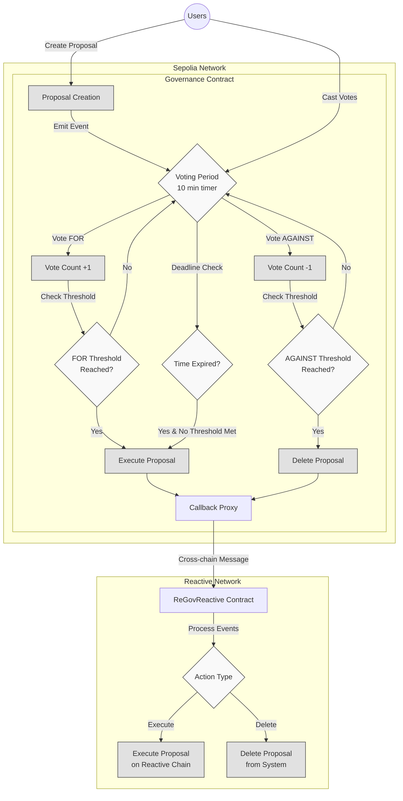

# Automated Governance Contract

## Overview

The Automated Governance Contract is a decentralized governance system that enables users to create proposals, vote on them, and execute or reject them based on voting outcomes. This system facilitates community-driven decision-making in a transparent and efficient manner across two blockchain networks.

### Key Features:

1. **Proposal Creation:** Users can create proposals with descriptions.
2. **Voting:** Users can vote for or against proposals.
3. **Automatic Execution:** Proposals are automatically executed or deleted based on voting outcomes and deadlines.
4. **Cross-Chain Communication:** Utilizes a reactive contract to monitor and respond to events on the origin chain.
5. **Event Emission:** Emits various events to track proposal lifecycle and voting activities.


## Contracts

The demo involves two main contracts:

1. **Origin Chain Contract:** `Governance` manages proposals, voting, and execution processes on the primary chain (Sepolia).

2. **Reactive Contract:** `ReGovReactive` listens for events from the Governance contract and triggers appropriate actions on the Reactive Network.

## Further Considerations

While this demo showcases basic automated governance, potential improvements include:

- **Enhanced Voting Mechanisms:** Implement weighted voting or quadratic voting.
- **Proposal Queuing:** Add a timelock feature for executed proposals.
- **Delegation:** Allow users to delegate their voting power.
- **Multi-chain Governance:** Extend the system to govern multiple chains simultaneously.

## Architecture And WorkFlow




## Deployment & Testing

To deploy and test the contracts, follow these steps. Ensure the following environment variables are configured appropriately:

* `SEPOLIA_RPC`
* `SEPOLIA_PRIVATE_KEY`
* `REACTIVE_RPC`
* `REACTIVE_PRIVATE_KEY`


You can use the recommended Sepolia RPC URL: `https://rpc2.sepolia.org`.

### NOTE BEFORE TESTING:
- Before testing, modify the in the [Governance.sol](https://github.com/Reactive-Network/reactive-smart-contract-demos/blob/main/src/demos/automated-governance/Governance.sol) contract according to the need like:
    - set the duration to 10 min or 1 min according to your need
    - set the VoteThreshold to be 1 or 2.


### Step 1: Deploy Governance contract on Sepolia

Deploy the Governance contract:

```sh
forge create --rpc-url $SEPOLIA_RPC --private-key $SEPOLIA_PRIVATE_KEY src/demos/automated-governance/Governance.sol:Governance --constructor-args 0x0000000000000000000000000000000000000000
```

The `Deployed to` address from the response should be assigned to `GOVERNANCE_ADDRESS`.


#### Callback Payment

To ensure a successful callback, the callback contract must have an ETH balance. You can find more details [here](https://dev.reactive.network/system-contract#callback-payments). To fund the callback contract, run the following command:

```bash
cast send $GOVERNANCE_ADDRESS --rpc-url $SEPOLIA_RPC --private-key $SEPOLIA_PRIVATE_KEY --value 0.1ether
```

Alternatively, you can deposit the funds into the callback proxy smart contract using this command:

```bash
cast send --rpc-url $SEPOLIA_RPC --private-key $SEPOLIA_PRIVATE_KEY $CALLBACK_PROXY_ADDR "depositTo(address)" $CALLBACK_ADDR --value 0.1ether
```


### Step 2: Deploy ReGovReactive contract on Reactive Network

Deploy the ReGovReactive contract, passing in the Subscription Service address and the Governance contract address:

```sh
forge create --rpc-url $REACTIVE_RPC --private-key $REACTIVE_PRIVATE_KEY src/demos/automated-governance/ReGovReactive.sol:ReGovReactive --constructor-args $GOVERNANCE_ADDRESS
```

### Step 3: Create a proposal

Call the createProposal function on the Governance contract:

```sh
cast send $GOVERNANCE_ADDRESS "createProposal(string memory)" task1 --rpc-url $SEPOLIA_RPC --private-key $SEPOLIA_PRIVATE_KEY
```

This creates a new proposal with a 10-minute deadline.

### Step 4: Vote on the proposal

Multiple users call the vote function to vote on the proposal:
** Note **: the creator of the proposal cannot vote on the proposal, use different accounts to vote

```sh
cast send $GOVERNANCE_ADDRESS "vote(uint256,bool)" 1 true --rpc-url $SEPOLIA_RPC --private-key $SEPOLIA_PRIVATE_KEY_VOTER
```

** NOTE **: if the threshold is set to 2 you need to vote for the third time so that it can check for the threshold and if the threshold is not reached 
the user might need to call this:

```bash
$ cast send $GOVERNANCE_ADDRESS "checkProposalDeadlines()" --rpc-url $SEPOLIA_RPC --private-key $SEPOLIA_PRIVATE_KEY
```

### Step 5: Proposal Resolution

The proposal will be automatically resolved based on voting outcomes:

- If the "For" threshold is reached, the Reactive contract will execute the proposal.
- If the "Against" threshold is reached, the Reactive Smart contract will "delete the proposal".
- If the deadline is reached without meeting either threshold, the Reactive contract will execute the proposal.

The system will automatically handle these actions based on the emitted events from the Governance contract.
