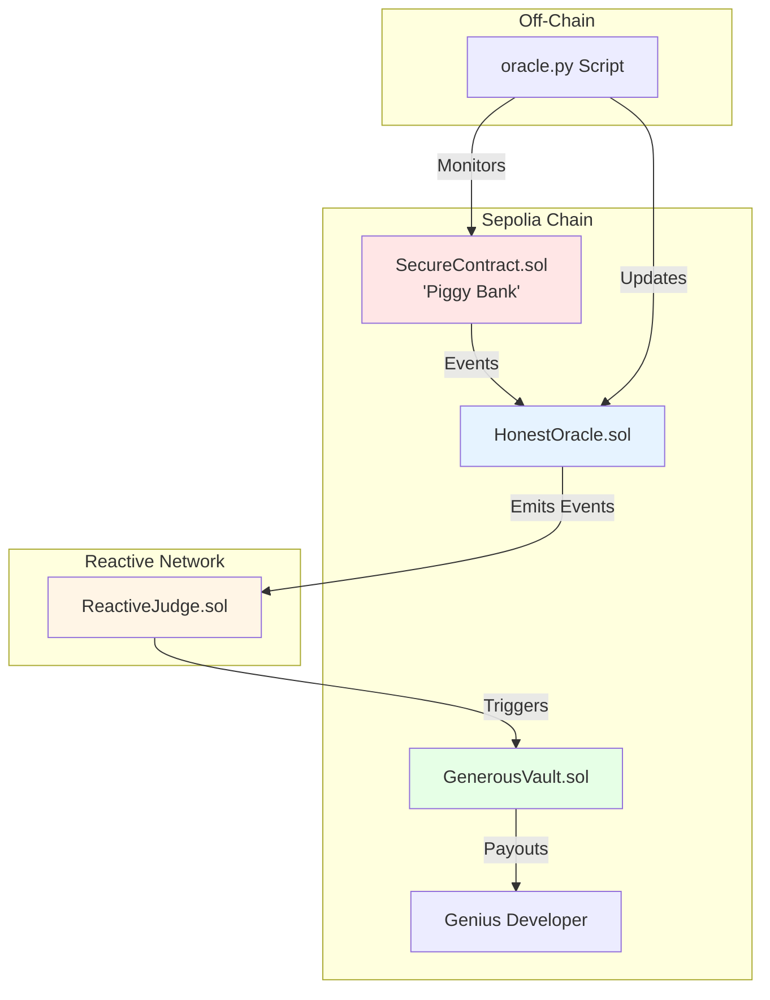

# Automated Insurance Payouts Demo

## Overview

This demo implements an Automated Insurance Payouts system using the Reactive Network. It uses EVM events as formal criteria for insurance claims and compensation in one automated step. The solution eliminates decision bias in the claim process and demonstrates a "Code Is Law" approach to insurance payouts.

Key features include:
- Automated claim processing based on smart contract events
- Elimination of manual claim review
- Application to existing deployed smart contracts
- Integration with Reactive Smart Contracts for enhanced flexibility

## Contracts and Components

The demo involves several key contracts and components:

1. **SecureContract.sol:** A "piggy bank" contract deployed by the Genius Developer, containing a bug that allows unauthorized fund transfers.

2. **HonestOracle.sol:** An oracle contract that monitors SecureContract transactions and emits events within the EVM.

3. **GenerousVault.sol:** A vault contract controlled by Whatever Insurance, used for storing and dispensing insurance payouts.

4. **ReactiveJudge.sol:** A Reactive Smart Contract that combines the roles of judge and executioner, listening for events from HonestOracle and initiating payouts from GenerousVault.

5. **oracle.py:** An off-chain Python script that watches SecureContract transactions and interacts with HonestOracle.

## Further Considerations

While this demo presents a simplified version of automated insurance payouts, there are several areas for potential improvement:

- Implementing more complex criteria for insurance claims
- Enhancing security measures to prevent intentional exploitation
- Incorporating premium calculations and insurance periods
- Expanding to cover a wider range of smart contract vulnerabilities



## Deployment & Testing

To deploy and test the contracts, follow these steps. Ensure the following environment variables are configured in your `.env` file:

* `SEPOLIA_RPC` — https://rpc2.sepolia.org
* `SEPOLIA_PRIVATE_KEY` — Ethereum Sepolia private key
* `REACTIVE_RPC` — https://kopli-rpc.rkt.ink
* `REACTIVE_PRIVATE_KEY` — Reactive Kopli private key
* `SEPOLIA_CALLBACK_PROXY_ADDR` — 0x33Bbb7D0a2F1029550B0e91f653c4055DC9F4Dd8
* `KOPLI_CALLBACK_PROXY_ADDR` — 0x0000000000000000000000000000000000FFFFFF

- Also configure the following for demo usage:
* `INFURA_PROJECT_ID=<INSERT_API_KEY_HERE>` //Infura API key to feed the oracle EVM data (free Core Plan is sufficient).
* `GENIUS_DEVELOPER_ADDR`
* `WHATEVER_INSURANCE_ADDR`
* `MYSTERIOUS_HECKER_ADDR`
* `GENIUS_DEVELOPER_PRIVATE_KEY`
* `WHATEVER_INSURANCE_PRIVATE_KEY`
* `MYSTERIOUS_HECKER_PRIVATE_KEY`

### Step 1: Preparations

1. Set up your `.env` file with the required variables.
2. Install the necessary Python libraries:
   ```
   pip3 install web3==6.20.0
   pip3 install python-dotenv==1.0.1   
   ```
   Docs:
   - [web3](https://web3py.readthedocs.io/en/latest/)
   - [dotenv](https://pypi.org/project/python-dotenv/1.0.1/)

### Step 2: Contract Deployment

1. Deploy SecureContract.sol:

   ```bash
   forge create --rpc-url $SEPOLIA_RPC --private-key $GENIUS_DEVELOPER_PRIVATE_KEY src/demos/automated-insurance-payouts/SecureContract.sol:SecureContract
   ```

2. Deploy HonestOracle.sol:

   ```bash
   forge create --rpc-url $SEPOLIA_RPC --private-key $WHATEVER_INSURANCE_PRIVATE_KEY src/demos/automated-insurance-payouts/HonestOracle.sol:HonestOracle
   ```
    The `Deployed to` address from the response should be assigned to `HONEST_ORACLE_ADDR`

    and 

    `0xbc81b6bd809362423e274881c88ccb051c3a5e8cf8c9b6f8b625ddb589484e85` to `HONEST_ORACLE_TOPIC_0`

3. Deploy GenerousVault.sol:

   ```bash
   forge create --rpc-url $SEPOLIA_RPC --private-key $WHATEVER_INSURANCE_PRIVATE_KEY src/demos/automated-insurance-payouts/GenerousVault.sol:GenerousVault --constructor-args 0x0000000000000000000000000000000000000000
   ```
    The `Deployed to` address from the response should be assigned to `GENEROUS_VAULT_ADDR`

#### Callback Payment

To ensure a successful callback, the callback contract must have an ETH balance. You can find more details [here](https://dev.reactive.network/system-contract#callback-payments). To fund the callback contract, run the following command:

```bash
cast send $GENEROUS_VAULT_ADDRESS --rpc-url $SEPOLIA_RPC --private-key $SEPOLIA_PRIVATE_KEY --value 0.1ether
```

Alternatively, you can deposit the funds into the callback proxy smart contract using this command:

```bash
cast send --rpc-url $SEPOLIA_RPC --private-key $SEPOLIA_PRIVATE_KEY $CALLBACK_PROXY_ADDR "depositTo(address)" $CALLBACK_ADDR --value 0.1ether
```


4. Deploy ReactiveJudge.sol:

   ```bash
   forge create --rpc-url $REACTIVE_RPC --private-key $WHATEVER_INSURANCE_PRIVATE_KEY src/demos/automated-insurance-payouts/ReactiveJudge.sol:ReactiveJudge --constructor-args $HONEST_ORACLE_ADDR $HONEST_ORACLE_TOPIC_0 $GENEROUS_VAULT_ADDR
   ```

### Step 3: Testing

1. Run the oracle backend service:
   ```
   python3 oracle.py
   ```

2. Send SepETH to SecureContract:
   ```
   cast send $SECURE_CONTRACT_ADDR --rpc-url $SEPOLIA_RPC --private-key $GENIUS_DEVELOPER_PRIVATE_KEY --value 0.002ether
   ```

3. Send SepETH to GenerousVault:
   ```
   cast send $GENEROUS_VAULT_ADDR --rpc-url $SEPOLIA_RPC --private-key $WHATEVER_INSURANCE_PRIVATE_KEY --value 0.004ether
   ```

4. Trigger the insurance incident:
   ```
   cast send $SECURE_CONTRACT_ADDR "transferEth(address,uint256)" $MYSTERIOUS_HECKER_ADDR 1000000000000000 --private-key $MYSTERIOUS_HECKER_PRIVATE_KEY --rpc-url $SEPOLIA_RPC
   ```

This should result in an automated insurance payout to the Genius Developer's address.

## Limitations and Comments

- This solution is for demonstration purposes and does not encourage unauthorized fund transfers.
- The implementation is simplified for clarity and educational purposes.
- Real-world insurance practices (premiums, insurance periods, etc.) are intentionally omitted for simplicity.
- The scenario assumes unintentional vulnerabilities; intentional exploitation could be an attack vector.
