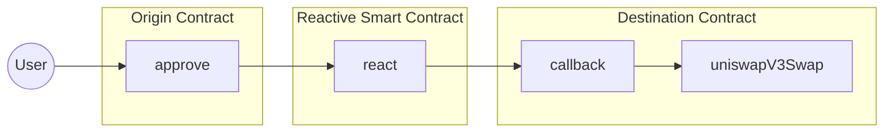

# Automated One-Step Swap on the Reactive Network

## Overview

This demo showcases an automated one-step token swap process using the Reactive Network. It simplifies the typical two-step DEX swapping process (approve and execute) into a single step, enhancing user experience and security. The system automatically resets approvals to zero after each swap, reducing the risk of unlimited approvals.

### Key Features:

1. **One-Step Swap:** Users only need to approve the swap; execution is automated.
2. **Auto-Reset Approvals:** Approvals are automatically set back to zero after each swap.
3. **Cross-Chain Interaction:** Utilizes contracts on both Sepolia and the Reactive Network.
4. **Uniswap V3 Integration:** Leverages Uniswap V3 for token swaps.


## Contracts

The demo involves three main contracts:

1. **Origin Contract:** ERC-20 token contract (e.g., WETH9, USDT) deployed on Sepolia.
2. **Reactive Contract:** [ReactiveContract.sol](https://github.com/Reactive-Network/reactive-smart-contract-demos/blob/main/src/demos/automated-one-step-swap/ReactiveContract.sol) deployed on the Reactive Network.
3. **Destination Contract:** [DestinationContract.sol](https://github.com/Reactive-Network/reactive-smart-contract-demos/blob/main/src/demos/automated-one-step-swap/DestinationContract.sol) deployed on Sepolia.

## Further Considerations

While this demo showcases a basic one-step swap process, potential improvements include:

- Implementing more efficient event filtering in the Reactive Smart Contract.
- Adding comprehensive testing suites.
- Enhancing access controls.
- Optimizing for gas efficiency.
- Supporting multiple token pairs and DEXes.

For this demonstration, we are using the [WETH9](https://sepolia.etherscan.io/address/0xfFf9976782d46CC05630D1f6eBAb18b2324d6B14) and [USDT](https://sepolia.etherscan.io/address/0xaA8E23Fb1079EA71e0a56F48a2aA51851D8433D0) ERC-20 contracts already deployed on Sepolia testnet.

>The origin contract is the same as the `TOKEN_IN_ADDRESS` in the enviroment variables as it is the token we put IN the swap router to sell.

## Working and Architecture of the Contracts



## Notes Before We Go Any Further:
1. We are using the Uniswap V3 Swap Router
2. This demonstration uses **WETH9** and **USDT** tokens deployed on Sepolia
3. You can exchange **SepoliaETH** for **WETH9** on [Uniswap's Sepolia Network](https://app.uniswap.org/swap?chain=sepolia).

if the link does not work navigate to [Weth9](https://github.com/Reactive-Network/reactive-smart-contract-demos/blob/main/src/demos/automated-one-step-swap/Weth.sol) Contract and load it for this address 0xfFf9976782d46CC05630D1f6eBAb18b2324d6B14


4. *Take care of the amount you enter*. USDT is is a token with 6 decimals and WETH with 18 decimals.  Therefore, your *values* for a single token are:
     - 1 USDT = 1,000,000
     - 1 WETH9 = 1,000,000,000,000,000,000
5. Finally, the steps below assume you have have cloned the repository and are familiar with using the terminal window

## Deployment & Testing

To deploy and test the contracts, follow these steps. Ensure the following environment variables are configured appropriately in the `.env` file:

* `SEPOLIA_RPC` — https://rpc2.sepolia.org
* `SEPOLIA_PRIVATE_KEY` — Ethereum Sepolia private key
* `REACTIVE_RPC` — https://kopli-rpc.rkt.ink
* `REACTIVE_PRIVATE_KEY` — Reactive Kopli private key
* `SEPOLIA_CALLBACK_PROXY_ADDR` — 0x33Bbb7D0a2F1029550B0e91f653c4055DC9F4Dd8
* `KOPLI_CALLBACK_PROXY_ADDR` — 0x0000000000000000000000000000000000FFFFFF
* `TOKEN_IN_ADDRESS` — 0xfFf9976782d46CC05630D1f6eBAb18b2324d6B14(Weth9-here for demonstration purpose can be changed as per requirement)
* `TOKEN_OUT_ADDRESS` —0xaA8E23Fb1079EA71e0a56F48a2aA51851D8433D0(USDT-here for demonstration purpose can be changed as per requirement)
* `AMOUNT_IN`

You can use the recommended Sepolia RPC URL: `https://rpc2.sepolia.org`.

### Step 1: Set up environment variables

Configure the `.env` file with appropriate keys, addresses, and endpoints.

### Acquire Weth9 

- using deposit function (payable):
    Weth9 contract is deployed on sepolia and users can get Weth9 contract by depositing sepolia ether in a 1:1 ratio

```bash
cast send --rpc-url $SEPOLIA_RPC --private-key $SEPOLIA_PRIVATE_KEY 0xfFf9976782d46CC05630D1f6eBAb18b2324d6B14 "deposit()" --value 0.1ether
``` 
-Checking the balance:
```bash
cast call --rpc-url $SEPOLIA_RPC --private-key $SEPOLIA_PRIVATE_KEY 0xfFf9976782d46CC05630D1f6eBAb18b2324d6B14 "balanceOf(address)" <your-address>
```
(The result will be in a hex value in the form of 10^18, to get the exact value in decimal convert this hex value to a decimal value)

### Step 2: Deploy Destination Contract

Deploy the `DestinationContract.sol` on Sepolia:

```bash
forge create --rpc-url $SEPOLIA_RPC --private-key $SEPOLIA_PRIVATE_KEY src/demos/automated-one-step-swap/DestinationContract.sol:DestinationContract --constructor-args 0x0000000000000000000000000000000000000000
```
The `Deployed to` address from the response should be assigned to `DESTINATION_CONTRACT_ADDRESS`

#### Callback Payment

To ensure a successful callback, the callback contract must have an ETH balance. You can find more details [here](https://dev.reactive.network/system-contract#callback-payments). To fund the callback contract, run the following command:

```bash
cast send $DESTINATION_CONTRACT_ADDRESS --rpc-url $SEPOLIA_RPC --private-key $SEPOLIA_PRIVATE_KEY --value 0.1ether
```

Alternatively, you can deposit the funds into the callback proxy smart contract using this command:

```bash
cast send --rpc-url $SEPOLIA_RPC --private-key $SEPOLIA_PRIVATE_KEY $CALLBACK_PROXY_ADDR "depositTo(address)" $CALLBACK_ADDR --value 0.1ether
```

### Step 3: Deploy Reactive Contract

Deploy the `ReactiveContract.sol` on the Reactive Network:

```bash
forge create --rpc-url $REACTIVE_RPC --private-key $REACTIVE_PRIVATE_KEY src/demos/automated-one-step-swap/ReactiveContract.sol:ReactiveContract --constructor-args $DESTINATION_CONTRACT_ADDRESS
```


### Step 4: (Optional) Set Input Parameters

If needed, adjust the input parameters for the Uniswap V3 swap router:

```bash
cast send $DESTINATION_CONTRACT_ADDRESS "setInputParameters(address,uint256,uint256)" $NEW_TOKEN_OUT_ADDRESS $NEW_AMOUNT_OUT_MIN $NEW_FEE --rpc-url $SEPOLIA_RPC --private-key $SEPOLIA_PRIVATE_KEY
```

### Step 5: Test the Swap

Initiate the swap by approving the Destination Contract to spend your tokens:
approve teh amount of token in(Weth9 here)

```bash
cast send --rpc-url $SEPOLIA_RPC --private-key $SEPOLIA_PRIVATE_KEY 0xfFf9976782d46CC05630D1f6eBAb18b2324d6B14 "approve(address,uint256)" $DESTINATION_CONTRACT_ADDRESS 100000000000000000
```

* wait for a few seconds

- check the updated usdt balance which should change corresponding to the amount of weth9 approved:
```bash
cast call --rpc-url $SEPOLIA_RPC --private-key $SEPOLIA_PRIVATE_KEY 0xfFf9976782d46CC05630D1f6eBAb18b2324d6B14 "balanceOf(address)" <your-address>
```
