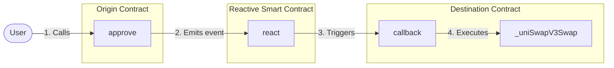

# Automated One-Step Swap on the Reactive Network

## Overview

This demo showcases an automated one-step token swap process using the Reactive Network. It simplifies the typical two-step DEX swapping process (approve and execute) into a single step, enhancing user experience and security. The system automatically resets approvals to zero after each swap, reducing the risk of unlimited approvals.

### Key Features:

1. **One-Step Swap:** Users only need to approve the swap; execution is automated.
2. **Auto-Reset Approvals:** Approvals are automatically set back to zero after each swap.
3. **Cross-Chain Interaction:** Utilizes contracts on both Sepolia and the Reactive Network.
4. **Uniswap V3 Integration:** Leverages Uniswap V3 for token swaps.

## Workflow



## Contracts

The demo involves three main contracts:

1. **Origin Contract:** ERC-20 token contract (e.g., WETH9, USDT) deployed on Sepolia.
2. **Reactive Contract:** `ReactiveContract.sol` deployed on the Reactive Network.
3. **Destination Contract:** `DestinationContract.sol` deployed on Sepolia.

## Further Considerations

While this demo showcases a basic one-step swap process, potential improvements include:

- Implementing more efficient event filtering in the Reactive Smart Contract.
- Adding comprehensive testing suites.
- Enhancing access controls.
- Optimizing for gas efficiency.
- Supporting multiple token pairs and DEXes.

## Deployment & Testing

To deploy and test the contracts, follow these steps. Ensure the following environment variables are configured appropriately in the `.env` file:

* `SEPOLIA_RPC`
* `SEPOLIA_PRIVATE_KEY`
* `REACTIVE_RPC`
* `REACTIVE_PRIVATE_KEY`
* `SYSTEM_CONTRACT_ADDR`
* `TOKEN_IN_ADDRESS`
* `TOKEN_OUT_ADDRESS`
* `AMOUNT_IN`

You can use the recommended Sepolia RPC URL: `https://rpc2.sepolia.org`.

### Step 1: Set up environment variables

Configure the `.env` file with appropriate keys, addresses, and endpoints.

### Step 2: Deploy Destination Contract

Deploy the `DestinationContract.sol` on Sepolia:

```sh
forge create --rpc-url $SEPOLIA_RPC --private-key $SEPOLIA_PRIVATE_KEY src/demos/automated-one-step-swap/DestinationContract.sol:DestinationContract
```

Save the deployed address in `DESTINATION_CONTRACT_ADDRESS` in the `.env` file.

### Step 3: Deploy Reactive Contract

Deploy the `ReactiveContract.sol` on the Reactive Network:

```sh
forge create --rpc-url $REACTIVE_RPC --private-key $REACTIVE_PRIVATE_KEY src/demos/automated-one-step-swap/ReactiveContract.sol:ReactiveContract --constructor-args $SYSTEM_CONTRACT_ADDR $DESTINATION_CONTRACT_ADDRESS
```

### Step 4: (Optional) Set Input Parameters

If needed, adjust the input parameters for the Uniswap V3 swap router:

```sh
cast send $DESTINATION_CONTRACT_ADDRESS "setInputParameters(address,uint256,uint256)" $NEW_TOKEN_OUT_ADDRESS $NEW_AMOUNT_OUT_MIN $NEW_FEE --rpc-url $SEPOLIA_RPC --private-key $SEPOLIA_PRIVATE_KEY
```

### Step 5: Test the Swap

Initiate the swap by approving the Destination Contract to spend your tokens:

```sh
cast send $TOKEN_IN_ADDRESS "approve(address,uint256)" $DESTINATION_CONTRACT_ADDRESS $AMOUNT_IN --rpc-url $SEPOLIA_RPC --private-key $SEPOLIA_PRIVATE_KEY
```
