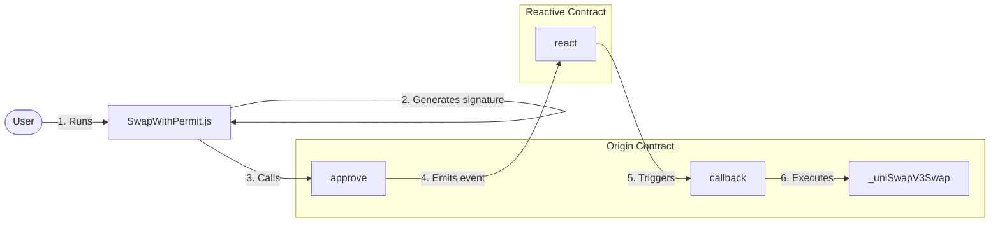

Certainly! I'll convert your README into a format similar to the examples you provided. Here's a restructured version of your README:

# Automated One-Step Swap with IERC20 Permit

## Overview

This demo showcases an automated one-step swap using the IERC20 Permit functionality. It differs from the implementation in the `/automated-one-step-swap` directory, swapping USDT for WETH9 instead of the reverse.

Key functionalities:
- Off-chain signature generation for permit
- Low-latency monitoring of approval events
- Automated execution of Uniswap V3 swaps



## Contracts

The demo involves two main contracts:

1. **Origin Chain Contract (`OriginWithPermitContract.sol`):** Deployed on Sepolia, this contract approves itself as the spender, transfers tokens from the user, and emits an `Approval` event. It then awaits the RSC to trigger the `callback()` function.

2. **Reactive Chain Contract (`ReactiveWithPermitContract.sol`):** Deployed on the Reactive chain, this contract listens for the `Approval` event from the Origin contract and calls the `callback()` function on the Origin contract to execute the swap.

## Further Considerations

Potential improvements include:
- Multi-token support
- Dynamic fee adjustment
- Integration with other DEXes
- Advanced slippage protection

## Deployment & Testing

To deploy and test the contracts, follow these steps. Ensure the following environment variables are configured in your `.env` file:

* `SEPOLIA_RPC`
* `SEPOLIA_PRIVATE_KEY`
* `REACTIVE_RPC`
* `REACTIVE_PRIVATE_KEY`
* `SYSTEM_CONTRACT_ADDR`
* `TOKEN_IN_WITH_PERMIT_ADDRESS`
* `TOKEN_OUT_WITH_PERMIT_ADDRESS`
* `AMOUNT_IN_WITH_PERMIT`
* `CALLBACK_ADDR`
* `CALLBACK_PROXY_ADDR`

### Step 1: Set up environment

```bash
cd src/demos/automated-one-step-swap/SwapWithPermit/
npm install dotenv ethers
```

### Step 2: Deploy Origin Contract

```bash
forge create --rpc-url $SEPOLIA_RPC --private-key $SEPOLIA_PRIVATE_KEY src/demos/automated-one-step-swap/SwapWithPermit/src/PermitContract.sol:PermitContract --constructor-args 0x0000000000000000000000000000000000000000
```

Assign the deployment address to `ORIGIN_WITH_PERMIT_CONTRACT_ADDRESS` in your `.env` file.


#### Callback Payment

To ensure a successful callback, the callback contract must have an ETH balance. You can find more details [here](https://dev.reactive.network/system-contract#callback-payments). To fund the callback contract, run the following command:

```bash
cast send $CALLBACK_ADDR --rpc-url $SEPOLIA_RPC --private-key $SEPOLIA_PRIVATE_KEY --value 0.1ether
```

Alternatively, you can deposit the funds into the callback proxy smart contract using this command:

```bash
cast send --rpc-url $SEPOLIA_RPC --private-key $SEPOLIA_PRIVATE_KEY $CALLBACK_PROXY_ADDR "depositTo(address)" $CALLBACK_ADDR --value 0.1ether
```


### Step 3: Deploy Reactive Contract

```bash
forge create --rpc-url $REACTIVE_RPC --private-key $REACTIVE_PRIVATE_KEY src/automated-one-step-swap/SwapWithPermit/src/ReactiveWithPermitContract.sol:ReactiveWithPermitContract --constructor-args $SYSTEM_CONTRACT_ADDR $ORIGIN_WITH_PERMIT_CONTRACT_ADDRESS
```


### Step 4: Test the Setup

```bash
cd src/demos/automated-one-step-swap/SwapWithPermit/script
node SwapWithPermit.js
```

This script will generate off-chain signatures and initiate the swap process.

## Troubleshooting

- Ensure Ethers.js is version 6.0.0 or higher
- Use appropriate parsing for large numbers in `AMOUNT_IN`
- Ensure sufficient SepoliaETH and REACT for gas fees
- Verify WETH9 balance in your Sepolia wallet
- Double-check environment variable loading with `source .env`
- Monitor events on Sepolia Etherscan for debugging
- Be cautious with token decimal places (USDT: 6, WETH9: 18)
- Remember `TOKEN_IN_WITH_PERMIT_ADDRESS` is the token you want to sell
- Note that WETH9 does not implement IERC20 Permit
