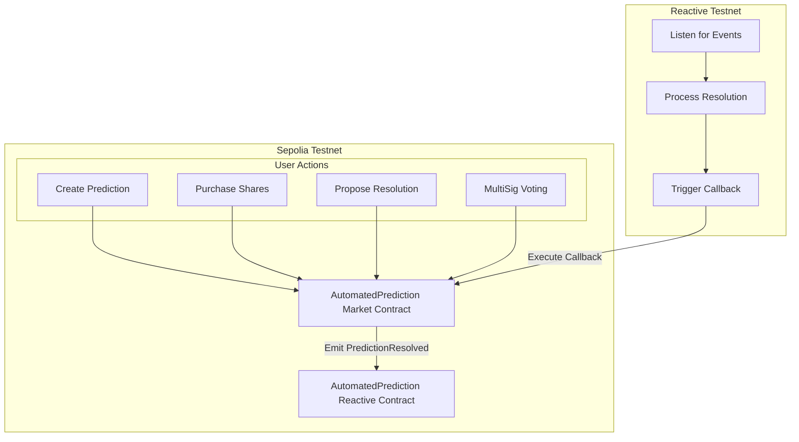

# Automated Prediction Market

## Overview

This demo implements an automated prediction market system across multiple chains, leveraging the usage of reactive smart contract. The provided smart contracts facilitate the creation, management, and resolution of prediction markets, with cross-chain interaction for automated distribution of winnings. The demo showcases how a prediction market service, integrated with the Reactive Network, can manage and execute cross-chain operations, with each smart contract serving a distinct role in the overall workflow.

## Contracts

The demo involves two main contracts:

1. **Sepolia Testnet Contract:** [AutomatedPredictionMarket](https://github.com/Reactive-Network/reactive-smart-contract-demos/blob/main/src/demos/automated-prediction-market/AutomatedPredictionMarket.sol) manages the core prediction market functionality, including market creation, share purchases, resolution proposals, and voting.

2. **Reactive Testnet Contract:** [AutomatedPredictionReactive](https://github.com/Reactive-Network/reactive-smart-contract-demos/blob/main/src/demos/automated-prediction-market/AutomatedPredictionReactive.sol) listens for prediction resolution events and triggers the distribution of winnings via callbacks to the origin contract.

## Further Considerations

Deploying these smart contracts in a live environment involves addressing key considerations:

- **Security:** Ensuring robust security measures for market creation, betting, and resolution processes.
- **Scalability:** Managing a high volume of predictions, bets, and cross-chain interactions.
- **Gas Optimization:** Reducing gas costs associated with market operations and cross-chain callbacks.

## Architecture And WorkFlow




## Deployment & Testing

This guide walks you through deploying and testing the `AutomatedPredictionMarket` demo on the Sepolia Testnet and the Reactive Testnet. Ensure the following environment variables are configured appropriately before proceeding:

* `SEPOLIA_RPC` — https://rpc2.sepolia.org
* `SEPOLIA_PRIVATE_KEY` — Ethereum Sepolia private key
* `REACTIVE_RPC` — https://kopli-rpc.rkt.ink
* `REACTIVE_PRIVATE_KEY` — Reactive Kopli private key
* `SEPOLIA_CALLBACK_PROXY_ADDR` — 0x33Bbb7D0a2F1029550B0e91f653c4055DC9F4Dd8
* `KOPLI_CALLBACK_PROXY_ADDR` — 0x0000000000000000000000000000000000FFFFFF

also configure the private keys and addresses of following, as will be used in this example :
* `MULTISIG_ADDRESS1`
* `MULTISIG_ADDRESS2`
* `MULTISIG1_PRIVATE_KEY`
* `MULTISIG2_PRIVATE_KEY`
* `VOTER1_PRIVATE_KEY`
* `VOTER2_PRIVATE_KEY`
* `VOTER3_PRIVATE_KEY`
* `PROPOSER_PRIVATE_KEY`

### Sepolia Testnet Steps

1. Deploy the `AutomatedPredictionMarket` contract:

```bash
forge create --rpc-url $SEPOLIA_RPC --private-key $SEPOLIA_PRIVATE_KEY src/demos/automated-prediction-market/AutomatedPredictionMarket.sol:AutomatedPredictionMarket --constructor-args 0x0000000000000000000000000000000000000000
```

The `Deployed to` address from the response should be assigned to `AUTOMATED_PREDICTION_MARKET_ADDRESS`

#### Callback Payment

To ensure a successful callback, the callback contract must have an ETH balance. You can find more details [here](https://dev.reactive.network/system-contract#callback-payments). To fund the callback contract, run the following command:

```bash
cast send $AUTOMATED_PREDICTION_MARKET_ADDRESS --rpc-url $SEPOLIA_RPC --private-key $SEPOLIA_PRIVATE_KEY --value 0.1ether
```

Alternatively, you can deposit the funds into the callback proxy smart contract using this command:

```bash
cast send --rpc-url $SEPOLIA_RPC --private-key $SEPOLIA_PRIVATE_KEY $CALLBACK_PROXY_ADDR "depositTo(address)" $CALLBACK_ADDR --value 0.1ether
```

### Reactive Deployment

#### Deploy the `AutomatedPredictionReactive` contract:

```bash
forge create --rpc-url $REACTIVE_RPC --private-key $REACTIVE_PRIVATE_KEY src/demos/automated-prediction-market/AutomatedPredictionReactive.sol:AutomatedPredictionReactive --constructor-args $SYSTEM_CONTRACT_ADDR $AUTOMATED_PREDICTION_MARKET_ADDRESS
```


2. Initialize the contract with required parameters initialize:
Demo_values:
* _minBet: 1000000000000000 wei (0.001 ETH)
* _feePercentage: 5 (5%)
* _referralRewardPercentage: 20 (20%)
* _multiSigWallet:[MULTISIG1,MULTISIG2]
* _requiredSignatures: 1

```bash
cast send $AUTOMATED_PREDICTION_MARKET_ADDRESS "initialize(uint256,uint256,uint256,address[],uint256)" --rpc-url $SEPOLIA_RPC --private-key $SEPOLIA_PRIVATE_KEY 1000000000000000 5 20 [$MULTISIG_ADDRESS1,$MULTISIG_ADDRESS2] 1 
```

3. Create a prediction:
Function: createPrediction
Parameters:
- _description: "Will ETH price touch $2,600 in next 15mins?"
- _duration: 900 (15 minutes)
- _options: [1, 2] (1 for Yes, 2 for No)
- _bettingDuration: 600 (10 minutes)
- _resolutionDuration: 300 (5 minutes after event ends)

```bash
cast send $AUTOMATED_PREDICTION_MARKET_ADDRESS "createPrediction(string,uint256,uint256[],uint256,uint256)" --rpc-url $SEPOLIA_RPC --private-key $SEPOLIA_PRIVATE_KEY "Will ETH price touch $2,600 in next 15mins?" 900 [1,2] 600 300
```

4. Users purchase shares:

- payable
- prediction id:0
- vote: 0 (for yes) || 1 (for no)

```bash
cast send $AUTOMATED_PREDICTION_MARKET_ADDRESS "purchaseShares(uint256,uint256)" --rpc-url $SEPOLIA_RPC --private-key $VOTER1_PRIVATE_KEY 0 0 --value 2000000000000000
```
```bash
cast send $AUTOMATED_PREDICTION_MARKET_ADDRESS "purchaseShares(uint256,uint256)" --rpc-url $SEPOLIA_RPC --private-key $VOTER2_PRIVATE_KEY 0 0 --value 1000000000000000
```
```bash
cast send $AUTOMATED_PREDICTION_MARKET_ADDRESS "purchaseShares(uint256,uint256)" --rpc-url $SEPOLIA_RPC --private-key $VOTER3_PRIVATE_KEY 0 0 --value 3000000000000000
```

5. Propose resolution:
to propose resolution to the listed prediction
- payable
- predictionID: 0(here for the demo as only one prediction has been created)
- outcome: true(for Yes) || false (for No)

```bash
cast send $AUTOMATED_PREDICTION_MARKET_ADDRESS "proposeResolution(uint256,bool)" --rpc-url $SEPOLIA_RPC --private-key $PROPOSER_PRIVATE_KEY 0 true --value 1000000000000000
```


6. (MultiSig Holders)Vote on resolution:
vote on proposed reolutions till the min required votes(in this demo it is 1) are in favour
- _predictionId: 0 (prediction id of the prediction to be resolved)
- _resolutionIndex: 0(here since only one resolution is passed)
- _support: true

```bash
cast send $AUTOMATED_PREDICTION_MARKET_ADDRESS "voteOnResolution(uint256,uint256,bool)" --rpc-url $SEPOLIA_RPC --private-key $MULTISIG1_PRIVATE_KEY 0 0 true
```
- When a prediction is resolved on Sepolia, the Reactive contract's `react` function is triggered automatically.
- The `react` function emits a `Callback` event to call `distributeWinnings` on Sepolia.


## Cross-chain Interaction

The cross-chain functionality is emulated by:

1. The `AutomatedPredictionMarket` contract on Sepolia emitting the `PredictionResolved` event.
2. The `AutomatedPredictionReactive` contract on Reactive listening for this event.
3. The Reactive contract then triggering a callback to Sepolia to distribute winnings.

This setup ensures that the two contracts communicate only through the Reactive Smart Contract, simulating a cross-chain interaction.
