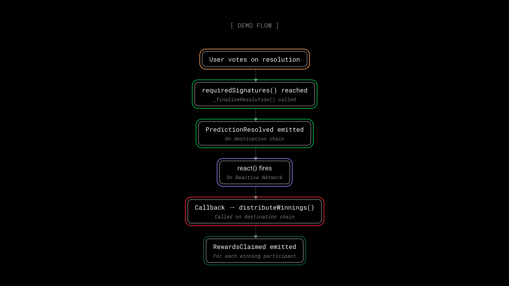

# Automated Prediction Market

## Overview

The **Automated Prediction Market** demo implements a prediction market with automated payouts. Users create a question (e.g. “Will ETH be above $3k next month?”), participants buy shares in different outcomes, and once the result is finalized, winnings are distributed automatically. No manual intervention is required to trigger payouts.



When a prediction is resolved on the destination chain, Reactive detects the event and triggers the distribution process, sending rewards to all winning participants.

## Contracts

**Prediction Market Contract**: [AutomatedPredictionMarket](https://github.com/Reactive-Network/reactive-smart-contract-demos/blob/update-prediction-market-demo/src/demos/automated-prediction-market/AutomatedPredictionMarketCallback.sol) manages the full lifecycle of a prediction market on a chosen chain, including market creation, share purchases, participant tracking, and resolution through a multisig voting process. Once consensus is reached, the contract finalizes the outcome and emits a `PredictionResolved` event. Winnings are not distributed immediately; instead, they are processed in batches via the `distributeWinnings` function, which can only be called by an authorized sender.

**Reactive Contract**: [AutomatedPredictionReactive](https://github.com/Reactive-Network/reactive-smart-contract-demos/blob/update-prediction-market-demo/src/demos/automated-prediction-market/AutomatedPredictionReactive.sol) runs on Reactive and listens for `PredictionResolved` events emitted by the prediction market on the destination chain. When such an event is detected, it extracts the relevant data and triggers a callback to the Prediction Market contract, invoking `distributeWinnings`.

This creates an automated flow where resolution on one chain directly initiates payouts, without requiring any off-chain services or manual execution.

## Deployment & Testing

### Environment Variables

Before proceeding further, configure these environment variables:

* `DESTINATION_RPC` — RPC URL for the destination chain, (see [Chainlist](https://chainlist.org)).
* `DESTINATION_PRIVATE_KEY` — Private key for signing transactions on the destination chain.
* `REACTIVE_RPC` — RPC URL for the Reactive Network (see [Reactive Docs](https://dev.reactive.network/reactive-mainnet)).
* `REACTIVE_PRIVATE_KEY` — Private key for signing transactions on the Reactive Network.
* `DESTINATION_CALLBACK_PROXY_ADDR` — The service address on the destination chain (see [Reactive Docs](https://dev.reactive.network/origins-and-destinations#callback-proxy-address)).
* `OWNER_WALLET` — EOA wallet address that will own and manage the contracts.
* `MULTISIG_ADDRESS1`, `MULTISIG_ADDRESS2` — Addresses of the multisig wallet holders.
* `MULTISIG1_PRIVATE_KEY`, `MULTISIG2_PRIVATE_KEY` — Private keys of the multisig wallet holders.
* `VOTER1_PRIVATE_KEY`, `VOTER2_PRIVATE_KEY`, `VOTER3_PRIVATE_KEY` — Private keys of share purchasers.
* `PROPOSER_PRIVATE_KEY` — Private key of the resolution proposer.

> ℹ️ **Reactive Faucet on Sepolia**
>
> To receive testnet REACT, send SepETH to the Reactive faucet contract on Ethereum Sepolia: `0x9b9BB25f1A81078C544C829c5EB7822d747Cf434`. The factor is 1/100, meaning you get 100 REACT for every 1 SepETH sent.
>
> **Important**: Do not send more than 5 SepETH per request, as doing so will cause you to lose the excess amount without receiving any additional REACT. The maximum that should be sent in a single transaction is 5 SepETH, which will yield 500 REACT.

> ⚠️ **Broadcast Error**
>
> If you see the following message: `error: unexpected argument '--broadcast' found`, it means your Foundry version (or local setup) does not support the `--broadcast` flag for `forge create`. Simply remove `--broadcast` from your command and re-run it.

### Step 1 — Callback Contract

Deploy the `AutomatedPredictionMarket` contract on your destination chain. The constructor requires the relevant [Callback proxy address](https://dev.reactive.network/origins-and-destinations#testnet-chains).

After deployment, save the contract address as `CALLBACK_ADDR`. This will be used in the next step.

```bash
forge create --broadcast --rpc-url $DESTINATION_RPC --private-key $DESTINATION_PRIVATE_KEY src/demos/automated-prediction-market/AutomatedPredictionMarketCallback.sol:AutomatedPredictionMarketCallback --value 0.01ether --constructor-args $DESTINATION_CALLBACK_PROXY_ADDR
```

### Step 2 — Reactive Contract

Deploy the `AutomatedPredictionReactive` contract on Reactive, passing the callback contract address from Step 1. 

After deployment, save the contract address as `REACTIVE_ADDR`.

```bash
forge create --broadcast --rpc-url $REACTIVE_RPC --private-key $REACTIVE_PRIVATE_KEY src/demos/automated-prediction-market/AutomatedPredictionReactive.sol:AutomatedPredictionReactive --value 1ether --constructor-args $CALLBACK_ADDR
```

### Step 3 — Initialize Callback Contract

Configure the Prediction Market constructor parameters. In this example:

* Minimum bet is **0.001 ETH** (1e15 wei)
* Platform fee is **5%**
* Referral reward is **20% of the fee**
* Two multisig addresses are set
* Only **1 signature** is required to finalize a resolution later

```bash
cast send $CALLBACK_ADDR "initialize(uint256,uint256,uint256,address[],uint256)" --rpc-url $DESTINATION_RPC --private-key $DESTINATION_PRIVATE_KEY 1000000000000000 5 20 [$MULTISIG_ADDRESS1,$MULTISIG_ADDRESS2] 1
```

### Step 4 — Create a Prediction

Create a new prediction market by defining the question, duration, available outcomes, and time windows for betting and resolution. In this example:

* Total duration is **15 minutes (900 seconds)**
* [1,2] are arbitrary identifiers for the two outcomes; all internal logic operates on their corresponding indices (`0` and `1`).
* Betting is open for **10 minutes (600 seconds)**
* Resolution proposals are allowed for **5 minutes (300 seconds)** after the market ends

```bash
cast send $CALLBACK_ADDR "createPrediction(string,uint256,uint256[],uint256,uint256)" --rpc-url $DESTINATION_RPC --private-key $DESTINATION_PRIVATE_KEY "Will ETH price touch \$2,600 in the next 15 mins?" 900 [1,2] 600 300
```

This creates prediction ID `0`.

### Step 5 — Purchase Shares

Users purchase shares for their chosen outcome. In this example:

* Prediction ID is `0`
* `0` refers to Option 1 (Yes), `1` refers to Option 2 (No)

```bash
cast send $CALLBACK_ADDR "purchaseShares(uint256,uint256)" --rpc-url $DESTINATION_RPC --private-key $VOTER1_PRIVATE_KEY 0 0 --value 2000000000000000
```

```bash
cast send $CALLBACK_ADDR "purchaseShares(uint256,uint256)" --rpc-url $DESTINATION_RPC --private-key $VOTER2_PRIVATE_KEY 0 0 --value 1000000000000000
```

```bash
cast send $CALLBACK_ADDR "purchaseShares(uint256,uint256)" --rpc-url $DESTINATION_RPC --private-key $VOTER3_PRIVATE_KEY 0 0 --value 3000000000000000
```

### Step 6 — Propose a Resolution (Optional)

Once the prediction period has ended, any participant can stake ETH to propose an outcome. In this example:

* Prediction ID is `0`
* Pass `true` to support the **Yes** outcome (option index `1`), and `false` for **No** (option index `0`).

```bash
cast send $CALLBACK_ADDR "proposeResolution(uint256,bool)" --rpc-url $DESTINATION_RPC --private-key $PROPOSER_PRIVATE_KEY 0 true --value 1000000000000000
```

### Step 7 — Vote on Resolution

Multisig holders vote on a proposed resolution. Once the required number of approvals is reached, the prediction is finalized and a `PredictionResolved` event is emitted. In this example:

* Prediction ID is `0`
* Resolution index is `0`
* `true` to support the proposal

```bash
cast send $CALLBACK_ADDR "voteOnResolution(uint256,uint256,bool)" --rpc-url $DESTINATION_RPC --private-key $MULTISIG1_PRIVATE_KEY 0 0 true
```

When the `PredictionResolved` event is emitted, the Reactive contract's `react` function fires automatically and emits a `Callback` to call `distributeWinnings` on the destination chain.

### Step 8 — Prediction State

Check the prediction state:

```bash
cast call $CALLBACK_ADDR "predictions(uint256)(string,uint256,uint256,bool,uint256,uint256,uint256,uint256,uint256)" 0 --rpc-url $DESTINATION_RPC
```

Example response:

```json
"Will ETH price touch 2600 in the next 15 mins?"    // description
1774418976                                          // endTime (timestamp when prediction ends)
5700000000000000                                    // totalShares (internal share accounting)
true                                                // isResolved (whether prediction is finalized)
0                                                   // outcome (winning option index: 0 = first option)
1774418676                                          // bettingEndTime (timestamp when betting closed)
1774419276                                          // resolutionEndTime (deadline for resolution proposals)
3                                                   // participants.length (number of participants)
5700000000000000                                    // totalBetAmount (total ETH in the pool)
```

## Managing the Market

### Set a Referral

Set a referrer address before purchasing shares. Referral rewards are paid from the platform fee.

```bash
cast send $CALLBACK_ADDR "setReferral(address)" --rpc-url $DESTINATION_RPC --private-key $VOTER1_PRIVATE_KEY $REFERRER_ADDRESS
```

### Check Multisig Membership

Verify whether an address is part of the multisig group responsible for voting on resolutions.

```bash
cast call $CALLBACK_ADDR "isMultiSigWallet(address)" --rpc-url $DESTINATION_RPC $MULTISIG_ADDRESS1
```
