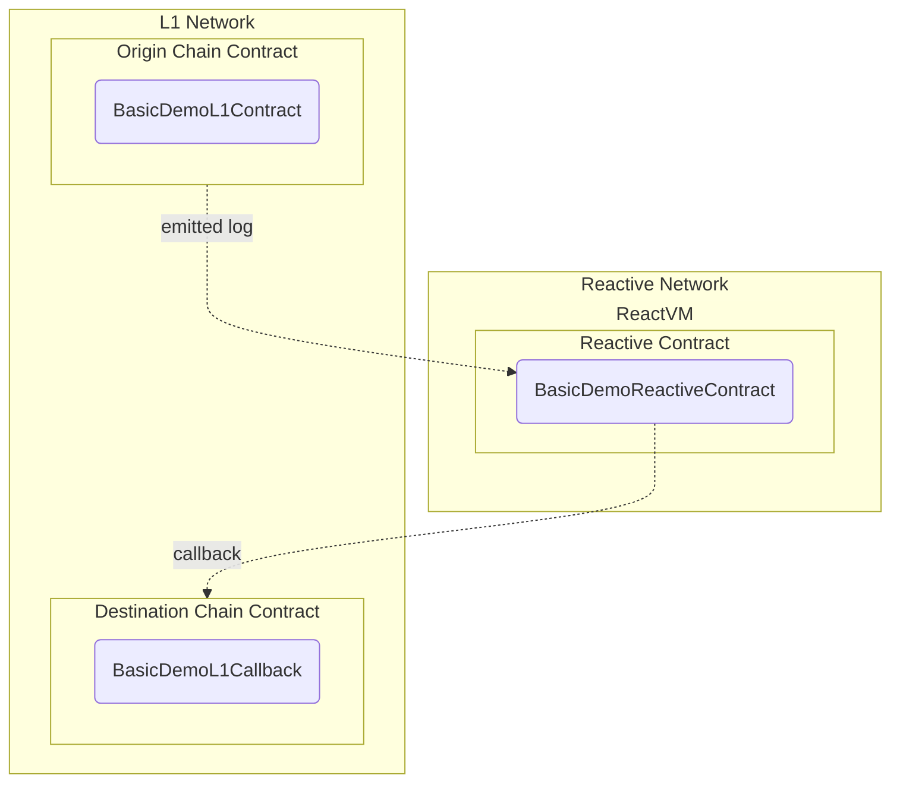

# Reactive Network Demo

## Overview

This demo simulates a basic use case of Reactive Network, employing two key capabilities:

* Low-latency monitoring of logs emitted by arbitrary contracts in L1 Network (Sepolia testnet in this case).
* Calls from Reactive Network to arbitrary L1 contracts.



In practical terms, this general use case can be applicable in any number of scenarios, from simple stop orders to fully decentralized algorithmic trading.

There are three main contracts involved in this scenario:

* Origin chain contract.
* Reactive contract.
* Destination chain contract.

### Origin Chain Contract

The `BasicDemoL1Contract` is a smart contract designed to receive and immediately return Ether to the transaction origin. It emits a `Received` event containing the origin address, sender address, and value of the Ether received. The `receive` function, a special fallback function, triggers this event and then transfers the received Ether back to the transaction origin.

### Reactive Contract

The `BasicDemoReactiveContract` is a smart contract designed for the Reactive Network, implementing the `IReactive` interface. It subscribes to events on the Sepolia chain and processes them through the `react` function. When an event is received, it emits a detailed `Event` log and, if certain conditions are met (e.g., `topic_3` is at least 0.1 ether), it triggers a callback to a predefined address. The contract includes a counter to track the number of processed events and provides methods for subscribing, unsubscribing, and resetting the counter. The constructor initializes the subscription service and sets up the initial event subscription.

### Destination Chain Contract

The `BasicDemoL1Callback` is a simple callback contract that logs the details of received callbacks. It includes a single function, `callback`, which emits a `CallbackReceived` event. This event captures the address of the transaction origin (`tx.origin`), the address that invoked the callback (`msg.sender`), and the sender address passed as an argument to the function.

Note that in real-world applications, the callback contract must verify the validity of the call by checking the message sender and/or verifying the current rate when executing a stop order.

### Further Considerations

The reactive contract in this demo leverages only a fraction of the capabilities available within the Reactive Network. Key areas for enhancement include:

* Subscription to Multiple Event Origins: Beyond the apparent utility, reactive contracts should subscribe to logs from their own callback contracts to maintain state consistency across networks.

* Dynamic Subscriptions and Unsubscriptions: Implementing the ability to dynamically subscribe and unsubscribe to events based on real-time conditions can improve flexibility and responsiveness.

* Persistent State Management: The demo contract currently reacts to events in isolation, without maintaining any meaningful state. Introducing persistent state can enable more complex and context-aware interactions.

* Arbitrary Callbacks: While the demo contracts call a predetermined method on a fixed contract, the ability to generate arbitrary transaction payloads would provide greater versatility and adaptability in various scenarios.

## Deployment & Testing

To deploy testnet contracts to Sepolia, follow these steps, making sure you substitute the appropriate keys, addresses, and endpoints where necessary. You will need the following environment variables configured appropriately to follow this script:

* `SEPOLIA_RPC`
* `SEPOLIA_PRIVATE_KEY`
* `REACTIVE_RPC`
* `REACTIVE_PRIVATE_KEY`
* `SYSTEM_CONTRACT_ADDR`

You can use the recommended Sepolia RPC URL: `https://rpc2.sepolia.org`.

### Step 1

Deploy the `BasicDemoL1Contract` (origin chain contract) and assign the `Deployed to` address from the response to `ORIGIN_ADDR`.

```bash
forge create --rpc-url $SEPOLIA_RPC --private-key $SEPOLIA_PRIVATE_KEY src/demos/basic/BasicDemoL1Contract.sol:BasicDemoL1Contract
```

### Step 2

Deploy the `BasicDemoL1Callback` (destination chain contract) and assign the `Deployed to` address from the response to `CALLBACK_ADDR`.

```bash
forge create --rpc-url $SEPOLIA_RPC --private-key $SEPOLIA_PRIVATE_KEY src/demos/basic/BasicDemoL1Callback.sol:BasicDemoL1Callback
```

### Step 3

Deploy the `BasicDemoReactiveContract` (reactive contract), configuring it to listen to `SOURCE_ADDR` and to send callbacks to `CALLBACK_ADDR`. The `Received` event on the origin chain contract has a topic 0 value of `0x8cabf31d2b1b11ba52dbb302817a3c9c83e4b2a5194d35121ab1354d69f6a4cb`, which we are monitoring.

```bash
forge create --rpc-url $REACTIVE_RPC --private-key $REACTIVE_PRIVATE_KEY src/demos/basic/BasicDemoReactiveContract.sol:BasicDemoReactiveContract --constructor-args $SYSTEM_CONTRACT_ADDR $ORIGIN_ADDR 0x8cabf31d2b1b11ba52dbb302817a3c9c83e4b2a5194d35121ab1354d69f6a4cb $CALLBACK_ADDR
```

### Step 4

Test the whole setup by sending some SepETH to `ORIGIN_ADDR`:

```bash
cast send $ORIGIN_ADDR --rpc-url $SEPOLIA_RPC --private-key $SEPOLIA_PRIVATE_KEY --value 0.11ether
```

This should eventually result in a callback transaction to `CALLBACK_ADDR` being initiated by the Reactive Network.
