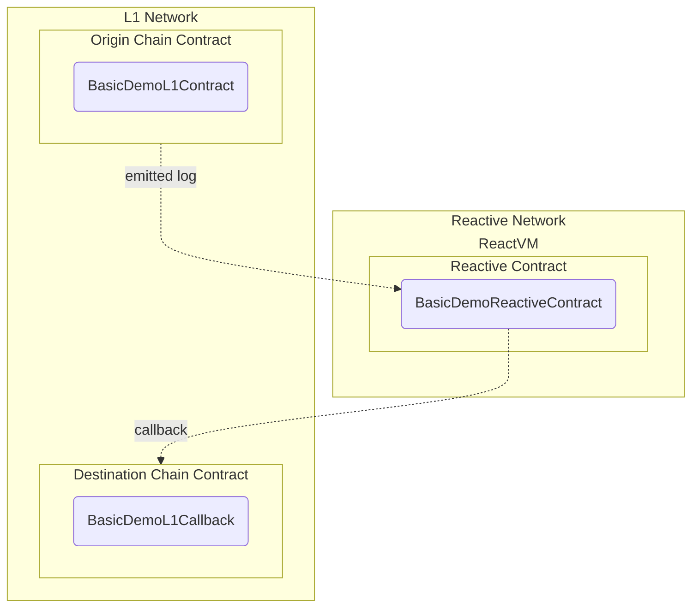

# Reactive Network Demo

## Overview

This demo illustrates a basic use case of the Reactive Network with two key functionalities:

* Low-latency monitoring of logs emitted by contracts on the origin chain (Sepolia testnet).
* Executing calls from the Reactive Network to contracts on the destination chain, also on Sepolia.



This setup can be adapted for various scenarios, from simple stop orders to fully decentralized algorithmic trading.

## Contracts

The demo involves three contracts:

1. **Origin Chain Contract:** `BasicDemoL1Contract` receives Ether and returns it to the sender, emitting a `Received` event with transaction details.

2. **Reactive Contract:** `BasicDemoReactiveContract` subscribes to events on Sepolia, emits logs, and triggers callbacks when conditions are met, such as `topic_3` being at least 0.1 Ether. It manages event subscriptions and tracks processed events.

3. **Destination Chain Contract:** `BasicDemoL1Callback` logs callback details upon receiving a call, capturing the origin, sender, and reactive sender addresses.

## Further Considerations

The demo highlights just a subset of Reactive Network's features. Potential improvements include:

- **Enhanced Event Subscriptions:** Subscribing to multiple event origins, including callback logs, to maintain consistency.
- **Dynamic Subscriptions:** Allowing real-time adjustments to subscriptions based on conditions.
- **State Management:** Introducing persistent state handling for more complex, context-aware reactions.
- **Flexible Callbacks:** Supporting arbitrary transaction payloads to increase adaptability.

## Deployment & Testing

To deploy testnet contracts to Sepolia, follow these steps, making sure you substitute the appropriate keys, addresses, and endpoints where necessary. You will need the following environment variables configured appropriately to follow this script:

* `SEPOLIA_RPC`
* `SEPOLIA_PRIVATE_KEY`
* `REACTIVE_RPC`
* `REACTIVE_PRIVATE_KEY`
* `SYSTEM_CONTRACT_ADDR`
* `CALLBACK_ADDR`
* `CALLBACK_PROXY_ADDR`

You can use the recommended Sepolia RPC URL: `https://rpc2.sepolia.org`.

### Step 1

Deploy the `BasicDemoL1Contract` (origin chain contract) and assign the `Deployed to` address from the response to `ORIGIN_ADDR`.

```bash
forge create --rpc-url $SEPOLIA_RPC --private-key $SEPOLIA_PRIVATE_KEY src/demos/basic/BasicDemoL1Contract.sol:BasicDemoL1Contract
```

### Step 2

Deploy the `BasicDemoL1Callback` (destination chain contract) and assign the `Deployed to` address from the response to `CALLBACK_ADDR`.

```bash
forge create --rpc-url $SEPOLIA_RPC --private-key $SEPOLIA_PRIVATE_KEY src/demos/basic/BasicDemoL1Callback.sol:BasicDemoL1Callback
```

#### Callback Payment

To ensure a successful callback, the callback contract must have an ETH balance. You can find more details [here](https://dev.reactive.network/system-contract#callback-payments). To fund the callback contract, run the following command:

```bash
cast send $CALLBACK_ADDR --rpc-url $SEPOLIA_RPC --private-key $SEPOLIA_PRIVATE_KEY --value 0.1ether
```

Alternatively, you can deposit the funds into the callback proxy smart contract using this command:

```bash
cast send --rpc-url $SEPOLIA_RPC --private-key $SEPOLIA_PRIVATE_KEY $CALLBACK_PROXY_ADDR "depositTo(address)" $CALLBACK_ADDR --value 0.1ether
```

### Step 3

Deploy the `BasicDemoReactiveContract` (reactive contract), configuring it to listen to `ORIGIN_ADDR` and to send callbacks to `CALLBACK_ADDR`. The `Received` event on the origin chain contract has a topic 0 value of `0x8cabf31d2b1b11ba52dbb302817a3c9c83e4b2a5194d35121ab1354d69f6a4cb`, which we are monitoring.

```bash
forge create --rpc-url $REACTIVE_RPC --private-key $REACTIVE_PRIVATE_KEY src/demos/basic/BasicDemoReactiveContract.sol:BasicDemoReactiveContract --constructor-args $SYSTEM_CONTRACT_ADDR $ORIGIN_ADDR 0x8cabf31d2b1b11ba52dbb302817a3c9c83e4b2a5194d35121ab1354d69f6a4cb $CALLBACK_ADDR
```

### Step 4

Test the whole setup by sending some SepETH to `ORIGIN_ADDR`:

```bash
cast send $ORIGIN_ADDR --rpc-url $SEPOLIA_RPC --private-key $SEPOLIA_PRIVATE_KEY --value 0.11ether
```

This should eventually result in a callback transaction to `CALLBACK_ADDR` being initiated by the Reactive Network.
