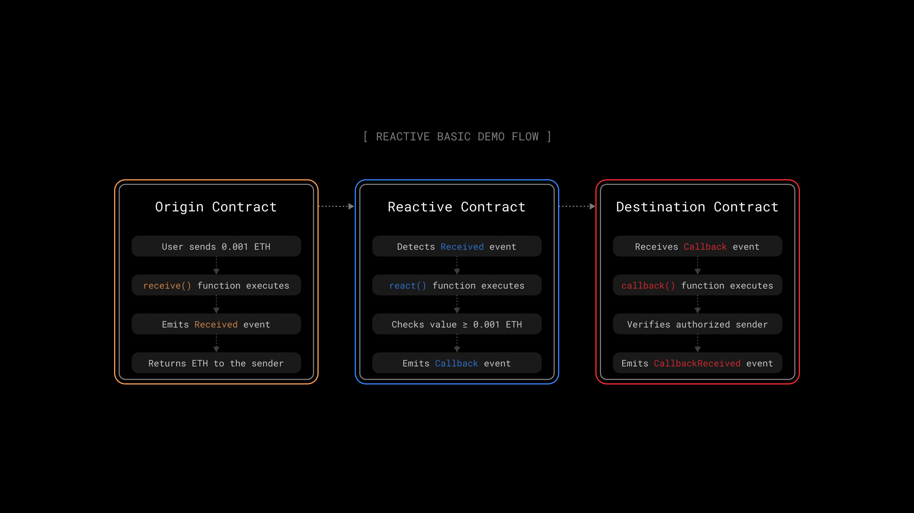

# Reactive Network Basic Demo

## Overview

The **Reactive Network Basic Demo** walks through the core Reactive pattern: a contract on an origin chain emits an event, Reactive detects it and automatically sends a callback to a contract on a destination chain. The destination contract doesn't contain any real business logic. It simply receives the callback, confirming that Reactive Network has performed its function successfully.

The demo focuses on two key behaviors. First, **low-latency monitoring**: Reactive watches for log events emitted by a contract on the origin chain. Second, **conditional reacting**: when a threshold is met (in this case, a transfer of at least **0.001 ETH**), Reactive triggers a callback to the destination chain.



The setup is intentionally minimal. The same pattern applies to more complex scenarios like stop orders, cross-chain arbitrage, or decentralized algorithmic trading.

## Contracts

**Origin Contract**: [BasicDemoL1Contract](https://github.com/Reactive-Network/reactive-smart-contract-demos/blob/main/src/demos/basic/BasicDemoL1Contract.sol) is the origin contract that accepts Ether, returns it to the sender, and emits a `Received` event containing the transaction origin, sender, and value. This event is what Reactive Network monitors.

**Reactive Contract**: [BasicDemoReactiveContract](https://github.com/Reactive-Network/reactive-smart-contract-demos/blob/main/src/demos/basic/BasicDemoReactiveContract.sol) is the Reactive contract, deployed on Reactive Network itself. On deployment, it subscribes to `Received` events from the origin contract. When an event arrives, the `react()` function checks whether the value (`topic_3`) meets a minimum threshold of **0.001 ETH**. If it does, the contract emits a `Callback` event with a payload targeting the destination contract.

**Destination Contract**: [BasicDemoL1Callback](https://github.com/Reactive-Network/reactive-smart-contract-demos/blob/main/src/demos/basic/BasicDemoL1Callback.sol) is the destination contract. It receives callbacks from Reactive Network, verifying that the caller is the authorized callback proxy, and emits a `CallbackReceived` event logging the transaction origin, sender, and Reactive sender addresses.

## Deployment & Testing

### Environment Variables

Before deploying, set the following environment variables:

* `ORIGIN_RPC` — RPC URL for the origin chain, (see [Chainlist](https://chainlist.org)).
* `ORIGIN_CHAIN_ID` — ID of the origin chain (see [Reactive Docs](https://dev.reactive.network/origins-and-destinations#mainnet-chains)).
* `ORIGIN_PRIVATE_KEY` — Private key for signing transactions on the origin chain.
* `DESTINATION_RPC` — RPC URL for the destination chain, (see [Chainlist](https://chainlist.org)).
* `DESTINATION_CHAIN_ID` — ID of the destination chain (see [Reactive Docs](https://dev.reactive.network/origins-and-destinations#mainnet-chains)).
* `DESTINATION_PRIVATE_KEY` — Private key for signing transactions on the destination chain.
* `REACTIVE_RPC` — RPC URL for Reactive Network (see [Reactive Docs](https://dev.reactive.network/reactive-mainnet)).
* `REACTIVE_PRIVATE_KEY` — Private key for signing transactions on Reactive Network.
* `DESTINATION_CALLBACK_PROXY_ADDR` — The callback proxy address on the destination chain (see [Reactive Docs](https://dev.reactive.network/origins-and-destinations#callback-proxy-address)).

> ℹ️ **Reactive faucet on Ethereum Sepolia**
>
> To receive testnet REACT, send SepETH to the Reactive faucet on Ethereum Sepolia: `0x9b9BB25f1A81078C544C829c5EB7822d747Cf434`. The exchange rate is 100 REACT per 1 SepETH. Do not send more than 5 SepETH in a single transaction as any excess is lost.

> ⚠️ **Broadcast Error**
> 
> If you see `error: unexpected argument '--broadcast' found`, your Foundry version does not support the `--broadcast` flag for `forge create`. Remove it from the command and re-run.

### Step 1 — Origin Contract

Deploy `BasicDemoL1Contract` and save the `Deployed to` address as `ORIGIN_ADDR`.

```bash
forge create --broadcast --rpc-url $ORIGIN_RPC --private-key $ORIGIN_PRIVATE_KEY src/demos/basic/BasicDemoL1Contract.sol:BasicDemoL1Contract
```

### Step 2 — Destination Contract

Deploy `BasicDemoL1Callback` and save the `Deployed to` address as `CALLBACK_ADDR`. This contract requires a small ETH deposit and takes the [callback proxy address](https://dev.reactive.network/origins-and-destinations#callback-proxy-address) as a constructor argument.

```bash
forge create --broadcast --rpc-url $DESTINATION_RPC --private-key $DESTINATION_PRIVATE_KEY src/demos/basic/BasicDemoL1Callback.sol:BasicDemoL1Callback --value 0.02ether --constructor-args $DESTINATION_CALLBACK_PROXY_ADDR
```

### Step 3 — Reactive Contract

Deploy `BasicDemoReactiveContract`, pointing it at the origin contract (`ORIGIN_ADDR`) on `ORIGIN_CHAIN_ID` and the destination contract (`CALLBACK_ADDR`) on `DESTINATION_CHAIN_ID`.

The topic_0 value `0x8cabf31d2b1b11ba52dbb302817a3c9c83e4b2a5194d35121ab1354d69f6a4cb` corresponds to the `Received` event signature that the Reactive contract subscribes to.

```bash
forge create --broadcast --rpc-url $REACTIVE_RPC --private-key $REACTIVE_PRIVATE_KEY src/demos/basic/BasicDemoReactiveContract.sol:BasicDemoReactiveContract --value 0.1ether --constructor-args $ORIGIN_CHAIN_ID $DESTINATION_CHAIN_ID $ORIGIN_ADDR 0x8cabf31d2b1b11ba52dbb302817a3c9c83e4b2a5194d35121ab1354d69f6a4cb $CALLBACK_ADDR
```

### Step 4 — Test Callback

Send at least **0.001 ETH** to the origin contract. This triggers the `Received` event, which the Reactive contract picks up and forwards as a callback to the destination chain.

```bash
cast send $ORIGIN_ADDR --rpc-url $ORIGIN_RPC --private-key $ORIGIN_PRIVATE_KEY --value 0.001ether
```

Once the transaction confirms, Reactive Network will initiate a callback transaction to `CALLBACK_ADDR`. You can verify it by checking the destination contract's events on Etherscan like shown [here](https://sepolia.etherscan.io/address/0x26fF307f0f0Ea0C4B5Df410Efe22754324DACE08#events).