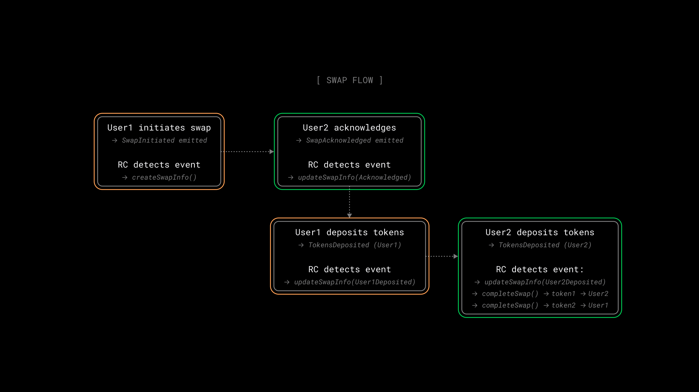

# Gasless Cross-Chain Atomic Swap Demo

## Overview

Swapping tokens across blockchains usually means trusting a bridge or custodian. This demo removes the middleman entirely. Two users exchange tokens across chains using a Reactive Contract (RC) that coordinates the whole process. The swap is atomic, meaning it either completes for both parties or doesn't happen at all. Users only pay gas on their own chain; the Reactive handles the rest.



## Contracts

**Callback Contract**: [GaslessDemoCrossChainAtomicSwapCallback](./GaslessDemoCrossChainAtomicSwapCallback.sol) is deployed on both participating chains. It handles the user-facing swap lifecycle: initiation, acknowledgment, deposits, and token distribution. It enforces state-machine transitions, timeout protection, and chain-context validation.

**Reactive Contract**: [GaslessDemoCrossChainAtomicSwapReactive](./GaslessDemoCrossChainAtomicSwapReactive.sol) is deployed on Reactive Network. It subscribes to events on both chains, syncs state between them, and triggers swap completion when all conditions are met. No manual interaction needed after deployment.

## Deployment & Testing

### Environment Variables

Before proceeding further, configure these environment variables:

* `SWAP_INITIATOR_RPC` — RPC URL for the swap initiator chain (see [Chainlist](https://chainlist.org)).
* `SWAP_CLOSER_RPC` — RPC URL for the swap closer chain (see [Chainlist](https://chainlist.org)).
* `SWAP_INITIATOR_PRIVATE_KEY` — Private key for signing transactions on the initiator chain.
* `SWAP_CLOSER_PRIVATE_KEY` — Private key for signing transactions on the closer chain.
* `REACTIVE_RPC` — RPC URL for the Reactive Network (see [Reactive Docs](https://dev.reactive.network/reactive-mainnet)).
* `REACTIVE_PRIVATE_KEY` — Private key for signing transactions on the Reactive Network.
* `SWAP_INITIATOR_CALLBACK_PROXY_ADDR` — Callback proxy address on the initiator chain (see [Reactive Docs](https://dev.reactive.network/origins-and-destinations#callback-proxy-address)).
* `SWAP_CLOSER_CALLBACK_PROXY_ADDR` — Callback proxy address on the closer chain.
* `USER1_WALLET` — User 1 address (swap initiator).
* `USER2_WALLET` — User 2 address (swap acknowledger).

> ℹ️ **Reactive Faucet on Sepolia**
>
> To receive testnet REACT, send SepETH to the Reactive faucet contract on Ethereum Sepolia: `0x9b9BB25f1A81078C544C829c5EB7822d747Cf434`. The factor is 1/100, meaning you get 100 REACT for every 1 SepETH sent.
>
> **Important**: Do not send more than 5 SepETH per request, as doing so will cause you to lose the excess amount without receiving any additional REACT. The maximum that should be sent in a single transaction is 5 SepETH, which will yield 500 REACT.

> ⚠️ **Broadcast Error**
>
> If you see the following message: `error: unexpected argument '--broadcast' found`, it means your Foundry version (or local setup) does not support the `--broadcast` flag for `forge create`. Simply remove `--broadcast` from your command and re-run it.

### Step 1 — Test Tokens

Deploy an ERC-20 test token on each chain (Initiator and Closer). Each contract mints 100 tokens to the deployer. Save the token addresses as `INITIATOR_TOKEN` and `CLOSER_TOKEN`.

```bash
forge create --broadcast --rpc-url $SWAP_INITIATOR_RPC --private-key $SWAP_INITIATOR_PRIVATE_KEY src/demos/gasless-cross-chain-atomic-swap/GaslessCrossChainAtomicSwapDemoToken.sol:GaslessCrossChainAtomicSwapDemoToken --constructor-args "Initiator Token" "ITK"
```

```bash
forge create --broadcast --rpc-url $SWAP_CLOSER_RPC --private-key $SWAP_CLOSER_PRIVATE_KEY src/demos/gasless-cross-chain-atomic-swap/GaslessCrossChainAtomicSwapDemoToken.sol:GaslessCrossChainAtomicSwapDemoToken --constructor-args "Closer Token" "CTK"
```

### Step 2 — Callback Contracts

Deploy the callback contract on both chains. Save the deployed addresses as `INITIATOR_CONTRACT` and `CLOSER_CONTRACT`. Pass the relevant [callback proxy address](https://dev.reactive.network/origins-and-destinations#testnet-chains).

```bash
forge create --broadcast --rpc-url $SWAP_INITIATOR_RPC --private-key $SWAP_INITIATOR_PRIVATE_KEY src/demos/gasless-cross-chain-atomic-swap/GaslessDemoCrossChainAtomicSwapCallback.sol:GaslessDemoCrossChainAtomicSwapCallback --value 0.01ether --constructor-args $SWAP_INITIATOR_CALLBACK_PROXY_ADDR
```

```bash
forge create --broadcast --rpc-url $SWAP_CLOSER_RPC --private-key $SWAP_CLOSER_PRIVATE_KEY src/demos/gasless-cross-chain-atomic-swap/GaslessDemoCrossChainAtomicSwapCallback.sol:GaslessDemoCrossChainAtomicSwapCallback --value 0.01ether --constructor-args $SWAP_CLOSER_CALLBACK_PROXY_ADDR
```

### Step 3 — Reactive Contract

Deploy the Reactive contract, passing the chain IDs and callback contract addresses. Save the deployed address as `REACTIVE_ADDR`. In this example:

* `84532` (Base Sepolia): the initiator chain
* `11155111` (Ethereum Sepolia): the closer chain 

Adjust to match your target networks.

```bash
forge create --broadcast --rpc-url $REACTIVE_RPC --private-key $REACTIVE_PRIVATE_KEY src/demos/gasless-cross-chain-atomic-swap/GaslessDemoCrossChainAtomicSwapReactive.sol:GaslessDemoCrossChainAtomicSwapReactive --value 1ether --constructor-args 84532 11155111 $INITIATOR_CONTRACT $CLOSER_CONTRACT
```

### Step 4 — Distribute Test Tokens

Transfer tokens to each user's wallet. User 1 transfers 50 tokens on the initiator chain:

```bash
cast send $INITIATOR_TOKEN 'transfer(address,uint256)' --rpc-url $SWAP_INITIATOR_RPC --private-key $SWAP_INITIATOR_PRIVATE_KEY $USER1_WALLET 50000000000000000000
```

User 2 transfers 25 tokens on the closer chain:

```bash
cast send $CLOSER_TOKEN 'transfer(address,uint256)' --rpc-url $SWAP_CLOSER_RPC --private-key $SWAP_CLOSER_PRIVATE_KEY $USER2_WALLET 25000000000000000000
```

### Step 5 — Approve Token Spending

Each user approves their respective callback contract to transfer tokens on their behalf.

```bash
cast send $INITIATOR_TOKEN 'approve(address,uint256)' --rpc-url $SWAP_INITIATOR_RPC --private-key $SWAP_INITIATOR_PRIVATE_KEY $INITIATOR_CONTRACT 50000000000000000000
```

```bash
cast send $CLOSER_TOKEN 'approve(address,uint256)' --rpc-url $SWAP_CLOSER_RPC --private-key $SWAP_CLOSER_PRIVATE_KEY $CLOSER_CONTRACT 25000000000000000000
```

### Step 6a — User 1 InitiatesSwap

> ℹ️ **User Private Keys**
>
> User 1 and User 2 must have different private keys. You can't swap tokens with identical keys.
>

User 1 initiates the swap, specifying: 

* token addresses and amounts (50 for initiator and 25 for closer)
* destination chain id (`11155111` for Ethereum Sepolia)
* timeout in seconds (swap expires after 3600 seconds)

```bash
cast send $INITIATOR_CONTRACT 'initiateSwap(address,uint256,address,uint256,uint256,uint256)' --rpc-url $SWAP_INITIATOR_RPC --private-key $SWAP_INITIATOR_PRIVATE_KEY $INITIATOR_TOKEN 50000000000000000000 $CLOSER_TOKEN 25000000000000000000 11155111 3600
```

Save the `swapId` (`topic1`) from the `SwapInitiated` event logs as `SWAP_ID`. The Reactive contract will automatically replicate the swap info on the closer chain.

### Step 6b — User 2 AcknowledgeSwap

Once the Reactive contract has called `createSwapInfo()` on the closer chain, user 2 can acknowledge the swap specifying `SWAP_ID` (topic 1 from Step 6a).

```bash
cast send $CLOSER_CONTRACT 'acknowledgeSwap(bytes32)' --rpc-url $SWAP_CLOSER_RPC --private-key $SWAP_CLOSER_PRIVATE_KEY $SWAP_ID
```

The Reactive contract will propagate the acknowledgment back to the initiator chain.

### Step 6c — User 1 DepositTokens

User 1 deposits tokens after acknowledgment is mirrored to the initiator chain:

```bash
cast send $INITIATOR_CONTRACT 'depositTokens(bytes32)' --rpc-url $SWAP_INITIATOR_RPC --private-key $SWAP_INITIATOR_PRIVATE_KEY $SWAP_ID
```

### Step 6d — User 2 DepositTokens

User 2 deposits tokens after the closer chain state updates to `User1Deposited`:

```bash
cast send $CLOSER_CONTRACT 'depositTokens(bytes32)' --rpc-url $SWAP_CLOSER_RPC --private-key $SWAP_CLOSER_PRIVATE_KEY $SWAP_ID
```

### Step 7 — Automatic Completion

After User 2's deposit, the Reactive contract automatically:

* Updates the swap state to `User2Deposited` on the initiator chain
* Calls `completeSwap()` on the initiator chain -> User 2 receives token 1
* Calls `completeSwap()` on the closer chain -> User 1 receives token 2

Monitor transaction logs on both chains via block explorers to verify completion.

### Step 8 — Verify Completion

Check token balances to confirm the swap succeeded. User 1's balance on the closer chain:

```bash
cast call $CLOSER_TOKEN 'balanceOf(address)' --rpc-url $SWAP_CLOSER_RPC $USER1_WALLET
```

User 2's balance on the initiator chain:

```bash
cast call $INITIATOR_TOKEN 'balanceOf(address)' --rpc-url $SWAP_INITIATOR_RPC $USER2_WALLET
```

Swap state on both chains (should return `5` = Completed):

```bash
cast call $INITIATOR_CONTRACT 'getSwapState(bytes32)' --rpc-url $SWAP_INITIATOR_RPC $SWAP_ID
cast call $CLOSER_CONTRACT 'getSwapState(bytes32)' --rpc-url $SWAP_CLOSER_RPC $SWAP_ID
```

## Management Functions

### Cancel a Swap

Either participant can cancel an active or timed-out swap. Deposited tokens are refunded automatically.

```bash
cast send $INITIATOR_CONTRACT 'cancelSwap(address,bytes32,string)' --rpc-url $SWAP_INITIATOR_RPC --private-key $SWAP_INITIATOR_PRIVATE_KEY 0x0000000000000000000000000000000000000000 $SWAP_ID "User requested cancellation"
```

### Query Swap Info

```bash
cast call $INITIATOR_CONTRACT 'getSwapInfo(bytes32)' --rpc-url $SWAP_INITIATOR_RPC $SWAP_ID
```

### Query User's Swaps

```bash
cast call $INITIATOR_CONTRACT 'getUserSwaps(address)' --rpc-url $SWAP_INITIATOR_RPC $USER1_WALLET
```

### Check Expiry

```bash
cast call $INITIATOR_CONTRACT 'isSwapExpired(bytes32)' --rpc-url $SWAP_INITIATOR_RPC $SWAP_ID
```
