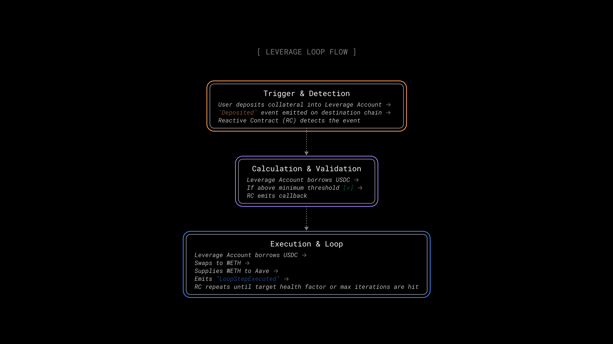

# Leverage Loop Demo

## Overview

The **Leverage Loop Demo** automates a common DeFi strategy: looping. You supply collateral to a lending protocol, borrow against it, swap the borrowed asset for more collateral, supply again, and repeat, stacking your position with each cycle. Doing this manually means multiple transactions and constant health factor monitoring.

This demo handles it end-to-end with Reactive. Deposit funds into a smart account, and `LoopingRC.sol` detects it and runs the loop automatically (borrow, swap, supply, repeat) until your target health factor is reached.



## Contracts

**Leverage Account**: [LeverageAccount](https://github.com/Reactive-Network/reactive-smart-contract-demos/blob/main/src/demos/leverage-loop/LeverageAccount.sol) is the user's personal vault on the destination chain (e.g., Ethereum Sepolia). It holds collateral and debt positions, and executes individual leverage steps (borrow, swap, supply) when triggered by Reactive. Uses real-time oracles for dynamic slippage protection.

**Reactive Contract**: [LoopingRC](https://github.com/Reactive-Network/reactive-smart-contract-demos/blob/main/src/demos/leverage-loop/LoopingRC.sol) monitors the `LeverageAccount` for `Deposited` and `LoopStepExecuted` events. On deposit, it initiates the first loop if the health factor is above the target (1.5). After each step, it checks whether the health factor has dropped below the safety threshold (1.2), reached the target, or hit the max iteration count (5), triggering the next loop if not.

## Deployment & Testing

### Environment Variables

Before deploying, set the following environment variables:

*   `DESTINATION_RPC` — RPC URL for the destination chain, (see [Chainlist](https://chainlist.org)).
*   `DESTINATION_PRIVATE_KEY` — Private key for signing transactions on the destination chain.
*   `REACTIVE_RPC` — RPC URL for Reactive Network (see [Reactive Docs](https://dev.reactive.network/reactive-mainnet)).
*   `REACTIVE_PRIVATE_KEY` — Private key for signing transactions on Reactive Network.
*   `DESTINATION_CALLBACK_PROXY_ADDR` — The service address on the destination chain (see [Reactive Docs](https://dev.reactive.network/origins-and-destinations#callback-proxy-address)).
*   `SYSTEM_CONTRACT_ADDR` — The service address on Reactive Network (see [Reactive Docs](https://dev.reactive.network/reactive-mainnet#overview)).
*   `CLIENT_WALLET` — Deployer's EOA wallet address

> ℹ️ **Reactive faucet on Ethereum Sepolia**
>
> To receive testnet REACT, send SepETH to the Reactive faucet on Ethereum Sepolia: `0x9b9BB25f1A81078C544C829c5EB7822d747Cf434`. The exchange rate is 100 REACT per 1 SepETH. Do not send more than 5 SepETH in a single transaction as any excess is lost.

> ⚠️ **Broadcast Error**
>
> If you see `error: unexpected argument '--broadcast' found`, your Foundry version does not support the `--broadcast` flag for `forge create`. Remove it from the command and re-run.

### Step 1 — Aave & Uniswap Configuration

Export the Aave V3 and Uniswap V3 addresses for Ethereum Sepolia:

```bash
# Aave V3 Pool
export POOL_ADDR=0x6Ae43d3271ff6888e7Fc43Fd7321a503ff738951

# Uniswap V3 SwapRouter
export ROUTER_ADDR=0x3bFA4769FB09eefC5a80d6E87c3B9C650f7Ae48E

# WETH (collateral)
export WETH_ADDR=0xC558DBdd856501FCd9aaF1E62eae57A9F0629a3c

# USDC (borrow asset, 6 decimals)
export BORROW_ASSET_ADDR=0x94a9D9AC8a22534E3FaCa9F4e7F2E2cf85d5E4C8
export BORROW_ASSET_DECIMALS=6
```

### Step 2 — Deploy Leverage Account

Deploy the user's smart account on the destination chain:

```bash
forge create --broadcast --value 0.001ether --rpc-url $DESTINATION_RPC --private-key $DESTINATION_PRIVATE_KEY src/demos/leverage-loop/LeverageAccount.sol:LeverageAccount --constructor-args $POOL_ADDR $ROUTER_ADDR $DESTINATION_CALLBACK_PROXY_ADDR $CLIENT_WALLET
```

Save the deployed address as `LEV_ACCOUNT_ADDR`.

### Step 3 — Deploy Reactive Contract

Deploy the looping logic on Reactive:

```bash
forge create --broadcast --value 1ether --rpc-url $REACTIVE_RPC --private-key $REACTIVE_PRIVATE_KEY src/demos/leverage-loop/LoopingRC.sol:LoopingRC --constructor-args $SYSTEM_CONTRACT_ADDR $LEV_ACCOUNT_ADDR $WETH_ADDR $BORROW_ASSET_ADDR $BORROW_ASSET_DECIMALS
```
Save the deployed address as `RC_ADDR`.

> **Note**: `LoopingRC` is configured for Ethereum Sepolia (chain ID `11155111`). If deploying destination contracts on a different chain, update the chain ID in `LoopingRSC.sol`.

### Step 4a — Authorize Reactive Contract

Authorize the RC to call `executeLeverageStep` on your Leverage Account:

```bash
cast send $LEV_ACCOUNT_ADDR "setRCCaller(address)" $RC_ADDR --rpc-url $DESTINATION_RPC --private-key $DESTINATION_PRIVATE_KEY
```

### Step 4b — Set Chainlink Oracles

Configure price feeds so the contract can calculate slippage protection.

```bash
# WETH/USD oracle on Ethereum Sepolia
cast send $LEV_ACCOUNT_ADDR "setOracle(address,address)" $WETH_ADDR $WETH_USD_ORACLE --rpc-url $DESTINATION_RPC --private-key $DESTINATION_PRIVATE_KEY

# USDC/USD oracle on Ethereum Sepolia
cast send $LEV_ACCOUNT_ADDR "setOracle(address,address)" $BORROW_ASSET_ADDR $USDC_USD_ORACLE --rpc-url $DESTINATION_RPC --private-key $DESTINATION_PRIVATE_KEY
```

### Step 4c — Fund Wallet with WETH

Fund your wallet with WETH by wrapping SepETH:

```bash
cast send $WETH_ADDR "deposit()" --value 0.01ether --rpc-url $DESTINATION_RPC --private-key $DESTINATION_PRIVATE_KEY
```

### Step 5 — Execute the Loop

Approve WETH spending:

```bash
DEPOSIT_AMOUNT=10000000000000000  # 0.01 WETH

cast send $WETH_ADDR "approve(address,uint256)" $LEV_ACCOUNT_ADDR $DEPOSIT_AMOUNT --rpc-url $DESTINATION_RPC --private-key $DESTINATION_PRIVATE_KEY
```

Deposit it into your Leverage Account:

```bash
cast send $LEV_ACCOUNT_ADDR "deposit(address,uint256)" $WETH_ADDR $DEPOSIT_AMOUNT --rpc-url $DESTINATION_RPC --private-key $DESTINATION_PRIVATE_KEY
```

Once the deposit lands:

1.  A `Deposited` event is emitted on the destination chain (e.g.,Ethereum Sepolia).
2.  `LoopingRC` detects the event on Reactive Network and calculates a safe borrow amount.
3.  If the borrow amount clears the minimum threshold, it emits a `Callback`.
4.  `LeverageAccount` receives the callback, borrows USDC, swaps it for WETH on Uniswap V3, and supplies the WETH back to Aave.
5.  A `LoopStepExecuted` event is emitted.
6.  `LoopingRC` detects and repeats the loop until the target health factor (1.5) is reached or max iterations (5) are hit.

Monitor execution on [Sepolia Etherscan](https://sepolia.etherscan.io/) and [Lasna Reactscan](https://lasna.reactscan.net/).

> **Minimum Deposit** `LoopingRC` enforces a minimum borrow threshold (`MIN_BORROW_USD`). The borrow amount is calculated as a percentage of your deposit's USD value:
>
> ```
> borrowAmountUSD = depositValueUSD * INITIAL_LEVERAGE_FACTOR / 10000
> ```
>
> With the default `INITIAL_LEVERAGE_FACTOR` of 40% and `MIN_BORROW_USD` of `$0.1` (testnet), your deposit must be worth at least **$0.25 USD** for the loop to start. Below that, the RC emits a `LoopStopped("Borrow amount below minimum")` and no callback is sent.
>
> For mainnet, increase `MIN_BORROW_USD` to a practical value (e.g., `10e18` for $10) to avoid dust-sized borrows.
>
> **Example** (at ETH ~ $2,600):
> 
> | Deposit    | USD Value | Borrow (40%) | Passes Min?   |
> |------------|-----------|--------------|---------------|
> | 0.001 WETH | ~$2.60    | ~$1.04       | Yes (testnet) |
> | 0.01 WETH  | ~$26      | ~$10.40      | Yes           |
> | 0.05 WETH  | ~$130     | ~$52         | Yes           |

### Troubleshooting

**`FailedInnerCall()` (selector `0x1425ea42`) on deposit:** An internal call failed. Common causes:

- Missing WETH approval, run the approve step first.
- Insufficient WETH balance. Check with:

  ```bash
  cast call $WETH_ADDR "balanceOf(address)(uint256)" $CLIENT_WALLET --rpc-url $DESTINATION_RPC
  ```
  
- Wrong WETH address. Aave V3 on Ethereum Sepolia uses `0xC558DBdd856501FCd9aaF1E62eae57A9F0629a3c`, **not** the canonical Ethereum Sepolia WETH (`0x7b79995e5f793A07Bc00c21412e50Ecae098E7f9`).

**`LoopStopped("Borrow amount below minimum")` on Reactive:** Your deposit is too small. Increase the deposit amount or lower `MIN_BORROW_USD` in `LoopingRC.sol` for testing.

**RC detects the event but no callback arrives on Ethereum Sepolia:** The RC needs native REACT tokens to pay for callbacks. Fund it:

```bash
cast send $RC_ADDR --value 1ether --rpc-url $REACTIVE_RPC --private-key $REACTIVE_PRIVATE_KEY
```

**Decoding revert data:**

```bash
cast 4byte 0x1425ea42  # Returns: FailedInnerCall()
```