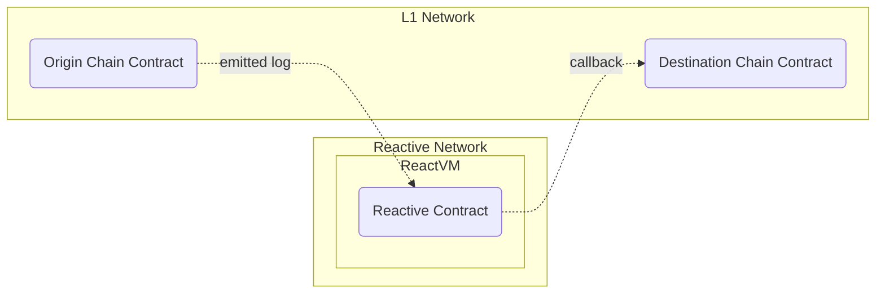

# Uniswap V2 Stop Order Demo

## Overview



This demo builds on the basic reactive example presented in `src/demos/basic/README.md`. Refer to that document for an outline of fundamental concepts and the architecture of reactive applications. The demo implements simple stop orders for Uniswap V2 liquidity pools. The application monitors a specified Uniswap V2 pair, and as soon as the exchange rate reaches a given threshold, it initiates a sale of assets through that same pair.

## Origin Chain Contract

The stop order application subscribes to `Sync` log records produced by a given Uniswap V2 token pair contract, typically emitted on swaps, and deposition or withdrawal of liquidity from the pool. Additionally, the reactive contract subscribes to events from its own callback contract to deactivate the stop order on completion. We anticipate this loopback of events from the callback contract to be a crucial element in many reactive applications.

## Reactive Contract

The reactive contract for stop orders subscribes to the specified L1 pair contract. The received `Sync` events enable the reactive contract to compute the current exchange rate for the two tokens in the pool. Once the rate reaches the threshold given on the contract's deployment, it requests a callback to L1 to sell the assets.

Upon initiating the order's execution, the reactive contract begins waiting for the `Stop` event from the L1 contract (which serves as both origin and destination in this case), indicating successful completion of the order. After receiving that, the reactive contract goes dormant, reverting all calls to it. Unlike the simple contract in the basic demo, this reactive contract is stateful.

The reactive contract is fully configurable and can be used with any Uniswap V2-compatible pair contract. The reactive contract for this demo is implemented in `UniswapDemoStopOrderReactive.sol`.

## Destination Chain Contract

This contract is responsible for the actual execution of the stop order. The client is required to allocate the token allowance for the callback contract and ensure they have sufficient tokens for executing the order. Upon the Reactive Network executing the callback transaction, this contract verifies the caller's address to prevent misuse or abuse, checks the current exchange rate against the given threshold, confirming the allowance, and validating the token balance. Then it initiates an exact token swap through the Uniswap V2 router contract, returning the earned tokens to the client. Following the successful execution of the order, the callback contract emits a `Stop` log record picked up by the reactive contract, as described in the section above.

The callback contract is stateless and may be used by any number of reactive stop order contracts, as long as they use the same router contract. The callback contract is implemented in `UniswapDemoStopOrderCallback.sol`.

## Further Considerations

While this demo covers a realistic use case, it is not a production-grade implementation, which would require more safety and sanity checks as well as a more complicated flow of state for its reactive contract. This demo is intended to showcase additional features of the Reactive Network compared to the basic demo, namely:

* Subscription to heterogeneous L1 events.

* Stateful reactive contracts.

* Loopback data flow between the reactive contract and the destination chain contract.

* Basic sanity checks required in destination chain contracts, both for security reasons and because callback execution is not synchronous with the execution of the reactive contract.

Nonetheless, a few further improvements could be made to bring this implementation closer to a practical stop order one:

* Leveraging dynamic event subscription to allow a single reactive contract to handle multiple arbitrary orders.

* Adding more sanity checks and a retry policy in the reactive contract.

* Supporting arbitrary routers on the destination side.

* Implementing a more elaborate data flow between the reactive contract and the destination chain contract.

* Supporting alternate DEXes.

## Deployment & Testing

This script guides you through deploying and testing a Uniswap V2 stop order demo on the Sepolia Testnet. Ensure the following environment variables are configured appropriately before proceeding with this script:

* `SEPOLIA_RPC`
* `SEPOLIA_PRIVATE_KEY`
* `REACTIVE_RPC`
* `REACTIVE_PRIVATE_KEY`
* `SYSTEM_CONTRACT_ADDR`

To test this live, you will need some testnet tokens and a Uniswap V2 liquidity pool for them. Use any pre-existing tokens and pair or deploy your own, e.g., the barebones ERC-20 token provided in `UniswapDemoToken.sol`.

### Step 1

Deploy two ERC-20 tokens. The constructor arguments are the token name and token symbol, which you can choose as you like. Upon creation, the token mints and transfers 100 units to the deployer.

```bash
forge create --rpc-url $SEPOLIA_RPC --private-key $SEPOLIA_PRIVATE_KEY src/demos/uniswap-v2-stop-order/UniswapDemoToken.sol:UniswapDemoToken --constructor-args $TOKEN_NAME $TOKEN_SYMBOL
```

Repeat the above command for the second token with a different name and symbol:

```bash
forge create --rpc-url $SEPOLIA_RPC --private-key $SEPOLIA_PRIVATE_KEY src/demos/uniswap-v2-stop-order/UniswapDemoToken.sol:UniswapDemoToken --constructor-args $TOKEN_NAME $TOKEN_SYMBOL
```

### Step 2

Create a Uniswap V2 pair (pool) using the token addresses created in Step 1. Note that the smaller address in hexadecimal is `token0` and the other is `token1`. Use the `PAIR_FACTORY_CONTRACT` address `0x7E0987E5b3a30e3f2828572Bb659A548460a3003`.

```bash
cast send $PAIR_FACTORY_CONTRACT 'createPair(address,address)' --rpc-url $SEPOLIA_RPC --private-key $SEPOLIA_PRIVATE_KEY $TOKEN0_ADDR $TOKEN1_ADDR
```

### Step 3

Deploy the destination chain contract to Sepolia. It is configured to use the Uniswap V2 router at `0xC532a74256D3Db42D0Bf7a0400fEFDbad7694008` associated with the factory contract at `0x7E0987E5b3a30e3f2828572Bb659A548460a3003`.

If you intend to use the pairs deployed by this factory, there is no need to deploy your own instance of the contract. In case you do require your own destination chain contract, deploy as follows:

```bash
forge create --rpc-url $SEPOLIA_RPC --private-key $SEPOLIA_PRIVATE_KEY src/demos/uniswap-v2-stop-order/UniswapDemoStopOrderCallback.sol:UniswapDemoStopOrderCallback --constructor-args $AUTHORIZED_CALLER_ADDRESS $UNISWAP_V2_ROUTER_ADDRESS
```

`AUTHORIZED_CALLER_ADDRESS`: The address authorized for callbacks (use `0x0000000000000000000000000000000000000000` to skip check).

`UNISWAP_V2_ROUTER_ADDRESS`: The Uniswap V2 router address.

### Step 4

Transfer some liquidity into the created pool. Note that you won't get its address immediately after `createPair()`. Get the newly created pair address from the transaction logs on [Sepolia scan](https://sepolia.etherscan.io/) where the `PairCreated` event is emitted.

```bash
cast send $TOKEN0_ADDR 'transfer(address,uint256)' --rpc-url $SEPOLIA_RPC --private-key $SEPOLIA_PRIVATE_KEY $CREATED_PAIR_ADDR 10000000000000000000
```

```bash
cast send $TOKEN1_ADDR 'transfer(address,uint256)' --rpc-url $SEPOLIA_RPC --private-key $SEPOLIA_PRIVATE_KEY $CREATED_PAIR_ADDR 10000000000000000000
```

```bash
cast send $CREATED_PAIR_ADDR 'mint(address)' --rpc-url $SEPOLIA_RPC --private-key $SEPOLIA_PRIVATE_KEY $SEPOLIA_ADDR
```

### Step 5

Deploy the reactive stop order contract to the Reactive Network as follows:

```bash
forge create --rpc-url $REACTIVE_RPC --private-key $REACTIVE_PRIVATE_KEY src/demos/uniswap-v2-stop-order/UniswapDemoStopOrderReactive.sol:UniswapDemoStopOrderReactive --constructor-args $SYSTEM_CONTRACT_ADDRESS $CREATED_PAIR_ADDR $CALLBACK_CONTRACT_ADDRESS $SEPOLIA_ADDR $DIRECTION_BOOLEAN $EXCHANGE_RATE_DENOMINATOR $EXCHANGE_RATE_NUMERATOR
```

`SYSTEM_CONTRACT_ADDRESS`: The system contract that handles event subscriptions.

`CREATED_PAIR_ADDR`: The Uniswap pair address from Step 2.

`CALLBACK_CONTRACT_ADDRESS`: The contract address from Step 3.

`SEPOLIA_ADDR`: The client's address initiating the order.

`DIRECTION_BOOLEAN`: `true` to sell `token0` and buy `token1`; `false` for the opposite.

`EXCHANGE_RATE_DENOMINATOR` and `EXCHANGE_RATE_NUMERATOR`: Integer representation of the exchange rate threshold below which a stop order is executed. These variables are set this way because the EVM works only with integers. As an example, to set the threshold at 1.234, the numerator should be 1234 and the denominator should be 100.

### Step 6

To initiate a new stop order, authorize the destination chain contract to spend your tokens:

```bash
cast send $TOKEN_ADDRESS 'approve(address,uint256)' --rpc-url $SEPOLIA_RPC --private-key $SEPOLIA_PRIVATE_KEY $CALLBACK_CONTRACT_ADDR 1000000000000000000
```

The last parameter is the raw amount you intend to authorize. For tokens with 18 decimal places, the above example allows the callback to spend one token.

### Step 7

After creating the pair and adding liquidity, we have to make the reactive smart contract work by adjusting the exchange rate directly through the pair, not the periphery.

Liquidity pools are rather simple and primitive contracts. They do not offer much functionality or protect the user from mistakes, making their deployment cheaper. That's why most users perform swaps through so-called peripheral contracts. These contracts are deployed once and can interact with any pair created by a single contract. They offer features to limit slippage, maximize swap efficiency, and more.

However, since our goal is to change the exchange rate, these sophisticated features are a hindrance. Instead of swapping through the periphery, we perform an inefficient swap directly through the pair, achieving the desired rate shift.

```bash
cast send $TOKEN0_ADDR 'transfer(address,uint256)' --rpc-url $SEPOLIA_RPC --private-key $SEPOLIA_PRIVATE_KEY $CREATED_PAIR_ADDR 20000000000000000
```

The following command executes a swap at a highly unfavorable rate, causing an immediate and significant shift in the exchange rate:

```bash
cast send $CREATED_PAIR_ADDR 'swap(uint,uint,address,bytes calldata)' --rpc-url $SEPOLIA_RPC --private-key $SEPOLIA_PRIVATE_KEY 0 5000000000000000 $SEPOLIA_ADDR "0x"
```

After that, the stop order will be executed and visible on [Sepolia scan](https://sepolia.etherscan.io/).