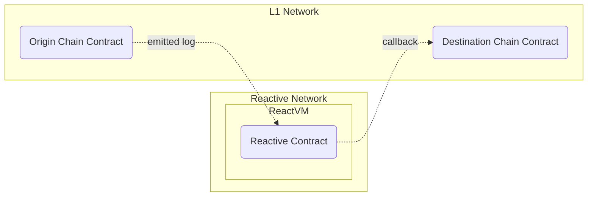

# Uniswap V2 Stop Order Demo

## Overview

This demo implements stop orders for Uniswap V2 liquidity pools using reactive contracts. It monitors a specified Uniswap V2 pair and triggers asset sales when the exchange rate reaches a defined threshold.



## Contracts

The demo involves three contracts:

1. **Origin Chain Contract:** `UniswapDemoToken` is a basic ERC-20 token with 100 tokens minted to the deployer's address. It provides integration points for Uniswap swaps.

2. **Reactive Contract:** `UniswapDemoStopOrderReactive` subscribes to a Uniswap V2 pair and stop order events. It checks if reserves fall below a threshold and triggers a stop order via callback.

3. **Destination Chain Contract:** `UniswapDemoStopOrderCallback` processes stop orders. It executes token swaps using the Uniswap V2 Router when triggered by the reactive contract.

## Further Considerations

The demo showcases essential stop order functionality but can be improved with:

- **Dynamic Event Subscriptions:** Supporting multiple orders and flexible event handling.
- **Sanity Checks and Retry Policies:** Adding error handling and retry mechanisms.
- **Support for Arbitrary Routers and DEXes:** Extending functionality to work with various routers and decentralized exchanges.
- **Improved Data Flow:** Refining interactions between reactive and destination chain contracts for better reliability.

## Deployment & Testing

This script guides you through deploying and testing the Uniswap V2 stop order demo on the Sepolia Testnet. Ensure the following environment variables are configured appropriately before proceeding with this script:

* `SEPOLIA_RPC`
* `SEPOLIA_PRIVATE_KEY`
* `REACTIVE_RPC`
* `REACTIVE_PRIVATE_KEY`
* `CALLBACK_ADDR`
* `CALLBACK_PROXY_ADDR`

To test this live, you will need some testnet tokens and a Uniswap V2 liquidity pool for them. Use any pre-existing tokens and pair or deploy your own, e.g., the barebones ERC-20 token provided in `UniswapDemoToken.sol`. You can use the recommended Sepolia RPC URL: `https://rpc2.sepolia.org`.

### Step 1

Deploy two ERC-20 tokens. The constructor arguments are the token name and token symbol, which you can choose as you like. Upon creation, the token mints and transfers 100 units to the deployer.

```bash
forge create --rpc-url $SEPOLIA_RPC --private-key $SEPOLIA_PRIVATE_KEY src/demos/uniswap-v2-stop-order/UniswapDemoToken.sol:UniswapDemoToken --constructor-args $TOKEN_NAME $TOKEN_SYMBOL
```

Repeat the above command for the second token with a different name and symbol:

```bash
forge create --rpc-url $SEPOLIA_RPC --private-key $SEPOLIA_PRIVATE_KEY src/demos/uniswap-v2-stop-order/UniswapDemoToken.sol:UniswapDemoToken --constructor-args $TOKEN_NAME $TOKEN_SYMBOL
```

### Step 2

Create a Uniswap V2 pair (pool) using the token addresses created in Step 1. Use the `PAIR_FACTORY_CONTRACT` address `0x7E0987E5b3a30e3f2828572Bb659A548460a3003`. You should get the newly created pair address from the transaction logs on [Sepolia scan](https://sepolia.etherscan.io/) where the `PairCreated` event is emitted.

**Note:** When determining which token is `token0` and which is `token1` in a Uniswap pair, the token with the smaller hexadecimal address value is designated as `token0`, and the other token is `token1`. This means you compare the two token contract addresses in their hexadecimal form, and the one that comes first alphabetically (or numerically since hexadecimal includes both numbers and letters) is `token0`.

```bash
cast send $PAIR_FACTORY_CONTRACT 'createPair(address,address)' --rpc-url $SEPOLIA_RPC --private-key $SEPOLIA_PRIVATE_KEY $TOKEN0_ADDR $TOKEN1_ADDR
```

### Step 3

Deploy the destination chain contract to Sepolia. Use the Uniswap V2 router at `0xC532a74256D3Db42D0Bf7a0400fEFDbad7694008`, which is associated with the factory contract at `0x7E0987E5b3a30e3f2828572Bb659A548460a3003`.

The `$AUTHORIZED_CALLER_ADDRESS` parameter can be omitted for the Uniswap stop order demo, as the contract executing the stop order already verifies its correctness. To skip this check, use the address `0x0000000000000000000000000000000000000000`.

Assign the `Deployed to` address from the response to `CALLBACK_ADDR`.

```bash
forge create --rpc-url $SEPOLIA_RPC --private-key $SEPOLIA_PRIVATE_KEY src/demos/uniswap-v2-stop-order/UniswapDemoStopOrderCallback.sol:UniswapDemoStopOrderCallback --constructor-args $AUTHORIZED_CALLER_ADDR $UNISWAP_V2_ROUTER_ADDR
```

#### Callback Payment

To ensure a successful callback, the callback contract must have an ETH balance. Find more details [here](https://dev.reactive.network/system-contract#callback-payments). To fund the contract, run the following command:

```bash
cast send $CALLBACK_ADDR --rpc-url $SEPOLIA_RPC --private-key $SEPOLIA_PRIVATE_KEY --value 0.1ether
```

To cover the debt of the callback contact, run this command:

```bash
cast send --rpc-url $SEPOLIA_RPC --private-key $SEPOLIA_PRIVATE_KEY $CALLBACK_ADDR "coverDebt()"
```

Alternatively, you can deposit funds into the [Callback Proxy](https://dev.reactive.network/origins-and-destinations) contract on Sepolia, using the command below. The EOA address whose private key signs the transaction pays the fee.

```bash
cast send --rpc-url $SEPOLIA_RPC --private-key $SEPOLIA_PRIVATE_KEY $CALLBACK_PROXY_ADDR "depositTo(address)" $CALLBACK_ADDR --value 0.1ether
```

### Step 4

Transfer some liquidity into the created pool:

```bash
cast send $TOKEN0_ADDR 'transfer(address,uint256)' --rpc-url $SEPOLIA_RPC --private-key $SEPOLIA_PRIVATE_KEY $CREATED_PAIR_ADDR 10000000000000000000
```

```bash
cast send $TOKEN1_ADDR 'transfer(address,uint256)' --rpc-url $SEPOLIA_RPC --private-key $SEPOLIA_PRIVATE_KEY $CREATED_PAIR_ADDR 10000000000000000000
```

```bash
cast send $CREATED_PAIR_ADDR 'mint(address)' --rpc-url $SEPOLIA_RPC --private-key $SEPOLIA_PRIVATE_KEY $CLIENT_WALLET
```

### Step 5

Deploy the reactive stop order contract to the Reactive Network, specifying the following:

`UNISWAP_V2_PAIR_ADDR`: The Uniswap pair address from Step 2.

`CALLBACK_ADDR`: The contract address from Step 3.

`CLIENT_WALLET`: The client's address initiating the order.

`DIRECTION_BOOLEAN`: `true` to sell `token0` and buy `token1`; `false` for the opposite.

`EXCHANGE_RATE_DENOMINATOR` and `EXCHANGE_RATE_NUMERATOR`: Integer representation of the exchange rate threshold below which a stop order is executed. These variables are set this way because the EVM works only with integers. As an example, to set the threshold at 1.234, the numerator should be 1234 and the denominator should be 1000.

```bash
forge create --rpc-url $REACTIVE_RPC --private-key $REACTIVE_PRIVATE_KEY src/demos/uniswap-v2-stop-order/UniswapDemoStopOrderReactive.sol:UniswapDemoStopOrderReactive --constructor-args $UNISWAP_V2_PAIR_ADDR $CALLBACK_ADDR $CLIENT_WALLET $DIRECTION_BOOLEAN $EXCHANGE_RATE_DENOMINATOR $EXCHANGE_RATE_NUMERATOR
```

### Step 6

To initiate a stop order, authorize the destination chain contract to spend your tokens. The last parameter is the raw amount you intend to authorize. For tokens with 18 decimal places, the above example allows the callback to spend one token.

```bash
cast send $TOKEN_ADDR 'approve(address,uint256)' --rpc-url $SEPOLIA_RPC --private-key $SEPOLIA_PRIVATE_KEY $CALLBACK_ADDR 1000000000000000000
```

### Step 7

After creating the pair and adding liquidity, we have to make the reactive smart contract work by adjusting the exchange rate directly through the pair, not the periphery.

Liquidity pools are rather simple and primitive contracts. They offer little functionality and don't protect the user from mistakes, making their deployment cheaper. That's why most users perform swaps through so-called peripheral contracts. These contracts are deployed once and can interact with any pair created by a single contract. They offer features to limit slippage, maximize swap efficiency, and more.

However, since our goal is to change the exchange rate, these sophisticated features are a hindrance. Instead of swapping through the periphery, we perform an inefficient swap directly through the pair, achieving the desired rate shift.

```bash
cast send $TOKEN0_ADDR 'transfer(address,uint256)' --rpc-url $SEPOLIA_RPC --private-key $SEPOLIA_PRIVATE_KEY $UNISWAP_V2_PAIR_ADDR 20000000000000000
```

The following command executes a swap at a highly unfavorable rate, causing an immediate and significant shift in the exchange rate:

```bash
cast send $UNISWAP_V2_PAIR_ADDR 'swap(uint,uint,address,bytes calldata)' --rpc-url $SEPOLIA_RPC --private-key $SEPOLIA_PRIVATE_KEY 0 5000000000000000 $CLIENT_WALLET "0x"
```

After that, the stop order will be executed and visible on [Sepolia scan](https://sepolia.etherscan.io/).