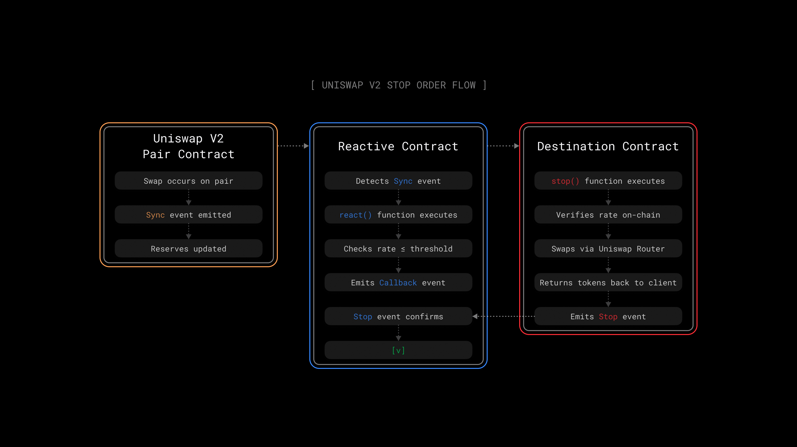

# Uniswap V2 Stop Order Demo

## Overview

The **Uniswap V2 Stop Order Demo** implements a decentralized stop-loss order for a Uniswap V2 trading pair using Reactive Network. A Reactive contract monitors the pair's `Sync` events, which fire on every swap and contain the updated reserve balances. When the exchange rate drops below a configured threshold, the Reactive contract triggers a callback to a destination chain contract, which executes the token swap through the Uniswap V2 Router and returns the proceeds to the client.



The Reactive contract is one-shot by design. Once the stop order fires, it listens for a confirmation `Stop` event from the destination contract and marks itself as done. The client must pre-approve the destination contract to spend their tokens before the stop order can execute.

## Contracts

**Token Contract**: [UniswapDemoToken](https://github.com/Reactive-Network/reactive-smart-contract-demos/blob/main/src/demos/uniswap-v2-stop-order/UniswapDemoToken.sol) is a minimal ERC-20 token that mints 100 tokens to the deployer on creation. It exists purely for testing. You can use any ERC-20 tokens that have a Uniswap V2 pair.

**Reactive Contract**: [UniswapDemoStopOrderReactive](https://github.com/Reactive-Network/reactive-smart-contract-demos/blob/main/src/demos/uniswap-v2-stop-order/UniswapDemoStopOrderReactive.sol) runs on Reactive Network. On deployment, it subscribes to two events on Ethereum Sepolia: the pair's `Sync` events (to track reserve changes) and the stop order contract's `Stop` events (to confirm execution). When a `Sync` event arrives, the `react()` function computes the exchange rate from the reserves and compares it against the configured threshold. If the rate has dropped below that threshold, it emits a `Callback` event targeting the destination contract. Once it receives the corresponding `Stop` event, it marks the order as done.

**Origin/Destination Chain Contract**: [UniswapDemoStopOrderCallback](https://github.com/Reactive-Network/reactive-smart-contract-demos/blob/main/src/demos/uniswap-v2-stop-order/UniswapDemoStopOrderCallback.sol) lives on the destination chain. When triggered, it re-verifies the exchange rate on-chain, transfers the client's approved tokens to itself, and executes the swap through the Uniswap V2 Router. The swapped tokens are sent back to the client, and a `Stop` event is emitted to signal completion to the Reactive contract. The contract is stateless, so a single deployment can serve multiple stop orders using the same router.

## Deployment & Testing

### Environment Variables

Before deploying, set the following environment variables:

* `DESTINATION_RPC` — RPC URL for the destination chain, (see [Chainlist](https://chainlist.org)).
* `DESTINATION_PRIVATE_KEY` — Private key for signing transactions on the destination chain.
* `REACTIVE_RPC` — RPC URL for Reactive Network (see [Reactive Docs](https://dev.reactive.network/reactive-mainnet)).
* `REACTIVE_PRIVATE_KEY` — Private key for signing transactions on Reactive Network.
* `DESTINATION_CALLBACK_PROXY_ADDR` — The callback proxy address on the destination chain (see [Reactive Docs](https://dev.reactive.network/origins-and-destinations#callback-proxy-address)).
* `CLIENT_WALLET` — Deployer's EOA wallet address

> ℹ️ **Reactive faucet on Ethereum Sepolia**
>
> To receive testnet REACT, send SepETH to the Reactive faucet on Ethereum Sepolia: `0x9b9BB25f1A81078C544C829c5EB7822d747Cf434`. The exchange rate is 100 REACT per 1 SepETH. Do not send more than 5 SepETH in a single transaction as any excess is lost.

> ⚠️ **Broadcast Error**
>
> If you see `error: unexpected argument '--broadcast' found`, your Foundry version does not support the `--broadcast` flag for `forge create`. Remove it from the command and re-run.

### Step 1 — Test Tokens

You can use pre-existing tokens or deploy your own. To use pre-existing tokens, export their addresses and skip the deployment commands:

```bash
export TK1=0x2AFDE4A3Bca17E830c476c568014E595EA916a04
export TK2=0x7EB2Ad352369bb6EDEb84D110657f2e40c912c95
```

To deploy new ERC-20 tokens, run the following for each token. Each mints 100 tokens to the deployer:

```bash
forge create --broadcast --rpc-url $DESTINATION_RPC --private-key $DESTINATION_PRIVATE_KEY src/demos/uniswap-v2-stop-order/UniswapDemoToken.sol:UniswapDemoToken --constructor-args TK1 TK1
```

```bash
forge create --broadcast --rpc-url $DESTINATION_RPC --private-key $DESTINATION_PRIVATE_KEY src/demos/uniswap-v2-stop-order/UniswapDemoToken.sol:UniswapDemoToken --constructor-args TK2 TK2
```

### Step 2 — Uniswap V2 Pair

If you're using the pre-existing tokens from Step 1, export their pair address:

```bash
export UNISWAP_V2_PAIR_ADDR=0x1DD11fD3690979f2602E42e7bBF68A19040E2e25
```

To create a new pair, call `createPair()` on the Uniswap V2 Factory at `0x7E0987E5b3a30e3f2828572Bb659A548460a3003`. After the transaction, retrieve the pair address from the `PairCreated` event on [Sepolia Etherscan](https://sepolia.etherscan.io/tx/0x4a373bc6ebe815105abf44e6b26e9cdcd561fb9e796196849ae874c7083692a4/advanced#eventlog) and export it as `UNISWAP_V2_PAIR_ADDR`.

```bash
cast send 0x7E0987E5b3a30e3f2828572Bb659A548460a3003 'createPair(address,address)' --rpc-url $DESTINATION_RPC --private-key $DESTINATION_PRIVATE_KEY $TOKEN0_ADDR $TOKEN1_ADDR
```

> 📝 **Note**  
> Token ordering is determined by address: the token with the smaller hexadecimal address becomes `token0`, the other becomes `token1`.

### Step 3 — Destination Contract

Deploy `UniswapDemoStopOrderCallback` with the [callback proxy address](https://dev.reactive.network/origins-and-destinations#callback-proxy-address) and the Uniswap V2 Router at `0xC532a74256D3Db42D0Bf7a0400fEFDbad7694008`. Save the `Deployed to` address as `CALLBACK_ADDR`.

```bash
forge create --broadcast --rpc-url $DESTINATION_RPC --private-key $DESTINATION_PRIVATE_KEY src/demos/uniswap-v2-stop-order/UniswapDemoStopOrderCallback.sol:UniswapDemoStopOrderCallback --value 0.02ether --constructor-args $DESTINATION_CALLBACK_PROXY_ADDR 0xC532a74256D3Db42D0Bf7a0400fEFDbad7694008
```

### Step 4 — Add Liquidity to the Pool

Transfer 10 tokens of each type into the pair and mint the LP tokens to your wallet:

```bash
cast send $TOKEN0_ADDR 'transfer(address,uint256)' --rpc-url $DESTINATION_RPC --private-key $DESTINATION_PRIVATE_KEY $UNISWAP_V2_PAIR_ADDR 10000000000000000000
```

```bash
cast send $TOKEN1_ADDR 'transfer(address,uint256)' --rpc-url $DESTINATION_RPC --private-key $DESTINATION_PRIVATE_KEY $UNISWAP_V2_PAIR_ADDR 10000000000000000000
```

```bash
cast send $UNISWAP_V2_PAIR_ADDR 'mint(address)' --rpc-url $DESTINATION_RPC --private-key $DESTINATION_PRIVATE_KEY $CLIENT_WALLET
```

### Step 5 — Reactive Contract

Deploy `UniswapDemoStopOrderReactive` with the following constructor arguments:

- `UNISWAP_V2_PAIR_ADDR` — The pair address from Step 2.
- `CALLBACK_ADDR` — The destination contract address from Step 3.
- `CLIENT_WALLET` — The wallet address initiating the stop order.
- `DIRECTION_BOOLEAN` — `true` to sell `token0` for `token1`; `false` for the reverse.
- `EXCHANGE_RATE_DENOMINATOR` and `EXCHANGE_RATE_NUMERATOR` — The threshold expressed as integers. For example, a threshold of 1.234 would use a denominator of `1000` and a numerator of `1234`.

```bash
forge create --broadcast --rpc-url $REACTIVE_RPC --private-key $REACTIVE_PRIVATE_KEY src/demos/uniswap-v2-stop-order/UniswapDemoStopOrderReactive.sol:UniswapDemoStopOrderReactive --value 0.1ether --constructor-args $UNISWAP_V2_PAIR_ADDR $CALLBACK_ADDR $CLIENT_WALLET $DIRECTION_BOOLEAN $EXCHANGE_RATE_DENOMINATOR $EXCHANGE_RATE_NUMERATOR
```

### Step 6 — Approve Token Spending

The destination contract needs permission to spend the client's tokens. Approve it by specifying the token address and amount. The example below approves 1 token (with 18 decimals):

```bash
cast send $TOKEN_ADDR 'approve(address,uint256)' --rpc-url $DESTINATION_RPC --private-key $DESTINATION_PRIVATE_KEY $CALLBACK_ADDR 1000000000000000000
```

### Step 7 — Trigger the Stop Order

To test the Reactive contract, shift the exchange rate by performing a direct swap through the pair. First, transfer a small amount of tokens into the pair:

```bash
cast send $TOKEN_ADDR 'transfer(address,uint256)' --rpc-url $DESTINATION_RPC --private-key $DESTINATION_PRIVATE_KEY $UNISWAP_V2_PAIR_ADDR 20000000000000000
```

Then execute a swap at an unfavorable rate to create a significant price shift:

```bash
cast send $UNISWAP_V2_PAIR_ADDR 'swap(uint,uint,address,bytes calldata)' --rpc-url $DESTINATION_RPC --private-key $DESTINATION_PRIVATE_KEY 0 5000000000000000 $CLIENT_WALLET "0x"
```

Once the exchange rate drops below the configured threshold, the Reactive contract will detect it and trigger the callback. You can verify execution by checking the contract events on [Sepolia Etherscan](https://sepolia.etherscan.io/). The callback can be viewed on the destination contract's event log, as shown [here](https://sepolia.etherscan.io/address/0xA8AE573e5227555255AAb217a86f3E9fE1Fc6631#events).
